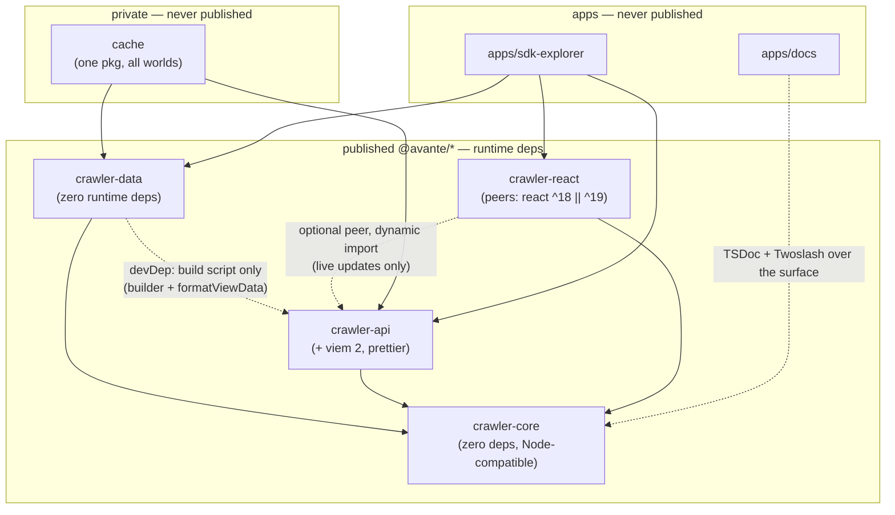

# crawler-sdk — SDK Specification

**Status:** _Living final specification — facts and specs only, no history and no open negotiation._ This document is the **single home of every settled fact** about the SDK. Anything still in flux (open decisions, future phases) lives in `specs/SDK_PLAN.md`; this document references it only where a settled spec abuts an open question. Code and this document move in lockstep (see `CLAUDE.md`).

References like _(#14)_ point to still-open decisions in `SDK_PLAN.md`; the specification around them stands regardless.

---

## Package map — what each package provides

The workspace inventory: each package, what it provides, and its published name (or explicitly *never published*).

| Package (path) | Published as | Provides |
|---|---|---|
| `packages/crawler-core` | **`@avante/crawler-core`** | The heart: `bigintish` module; schemas (`ec`, `cnc`); `World`/`View` types + read functions; coordinate math (Compass ↔ Coord ↔ Slug, neighbor offsets); the `Crawler` client (handle + container — see §The `Crawler` client); chamber locators (`resolveCoord`) and the schema invalidation primitive (`getInvalidatedCoords`). **Zero runtime deps; Node-compatible (no browser APIs).** Single root export (the legacy `./internal` importer subpath died with the global store). |
| `packages/crawler-data` | **`@avante/crawler-data`** | Static worlds as **one subpath export per world** (`@avante/crawler-data/mainnet`, `/goerli`, `/sepolia`; a `cnc` world in v1) — the root exports **no world JSON**, so bundles carry exactly the worlds imported; each world export **bundles its schema's converter** alongside the world data (see §The `Crawler` client); per-schema **converters** (pure: token payload → `ChamberData<Schema>`; payload types live beside them); the **builder** (build-time module: reads `cache/data`, converts, writes world JSON via the canonical serializer — `formatViewData`, imported from `crawler-api`). **Zero runtime deps** — `crawler-api` is a devDependency used by the build script only (it also supplies `formatViewData`; `prettier` never enters `crawler-data`). |
| `packages/crawler-api` | **`@avante/crawler-api`** | On-chain layer, viem 2 only — a **pure contract interface** (see §`crawler-api`): fully-typed per-world viem contract instances + parsed-result helpers (`tokenURI` / `ownerOf` / `totalSupply`; caller-supplied viem client or RPC url, or a warned public fallback — never ours); known & generic non-chamber contract helpers (`getCardsContract()`, ERC-20/ERC-721); the **live watcher** (poll-based mint detection) + the **per-schema payload assemblers** — the SDK's single fetch/assembly implementation, consumed by the cache fetch and the live path alike; **owner helpers** scoped to the connected player + delegate.xyz (#17); the **canonical serializer `formatViewData`** (see §Canonical serialization — the package's one non-contract member; must not be removed from this package). Depends on core only (+ viem + prettier). |
| `packages/crawler-react` | **`@avante/crawler-react`** | `CrawlerProvider` (+ the zero-config **`liveUpdate`** prop) + the hook surface over the explicit `Crawler` (lookup by locator, enumeration, selector, the live hook — see §`crawler-react`); the **`<ChamberSvg>`** display component; **localStorage persistence of live chambers** (the only browser-dependent code in the SDK). Peers: react ^18 ‖ ^19, core; `crawler-api` is an **optional peer**, dynamically imported only when live updates are enabled. |
| `cache` | — **never published** (private) | **One contract-agnostic package** archiving `tokenURI` output for every SDK world contract (EC mainnet today; C&C in v1) — per token `<tokenId>.json` (for `ec` worlds with the on-chain `Crawl.ChamberData` struct embedded as `chamber`) + `<tokenId>.svg` (+ `<tokenId>.html`, `ec` only) and a per-`dataDir` `_cache.json` provenance/state file, under `cache/data/<dataDir>/` (`dataDir` includes the deployment, e.g. `endless-crawler/mainnet` — `network` alone collides), committed (see §Data pipeline). Which worlds are cached — and their `dataDir` + RPC env-var name — is declared in `cache/worlds.json`; the contract binding comes from the `crawler-data` world (never restated). **One generic fetch script serves all worlds** (the fetch is contract-agnostic). **Mainnet only** — goerli is unfetchable (dead chain), its world stays frozen. Fetches via `crawler-api`; consumed by `crawler-data`'s builder. Lives under `cache/` (not `packages/`) precisely so it never leaves the repo. |
| `apps/sdk-explorer` | — never published (app) | The SDK's **browse tool** (cached, parsed, and on-chain data — token SVGs for visuals) and **API provider**: **same-origin-by-default** data routes (chamber lookups + whole-world payloads) plus on-chain routes served **converted to `ChamberData`** (cached-vs-live compare); CORS opt-in per deployment. **Dogfoods the public SDK surface only** — no internal imports. Next 16 App Router. |
| `apps/docs` | — never published (app) | vocs docs site, **hybrid**: a **generated symbol reference** (typedoc + typedoc-plugin-markdown emitting MDX into the git-ignored `src/pages/reference/`, rendered by vocs full-static) + **hand-authored MDX guides**; code examples Twoslash-verified against the built `dist` types. **The docs build is the gate** (`pnpm run check:docs`, CI-wired when CI exists) — a broken example or an undocumented export turns it red (what makes the documented-surface rule enforceable). |
| `packages/crawler-contracts` | _(planned, out of refactor scope)_ | Solidity contracts — README lists it as planned; untouched by the refactor. |

**Dependency rules:** the published runtime graph is **`data` / `api` / `react` → `core`** and nothing else — `data` never runtime-depends on `api` (build script only), `api` never depends on `data`, `core` depends on nothing. One deliberate softening: `react` declares `api` as an **optional peer** and `import()`s it lazily, exclusively on the live path — a game that never enables `liveUpdate` never installs it (a missing install surfaces as a typed error only when live updates are switched on). The `cache` package may depend on anything (private, build-time only); it depends on `data` (world binding) + `api` (fetching) + `core`, and `data` never depends back on `cache` (its builder reads `cache/worlds.json` by fs path, not a package import).

**Minimal-consumer rule:** everything that deals directly with `ChamberData` lives in `crawler-core`. A complete game can be built from **`crawler-core` + one world from `crawler-data`** alone — the client and all libraries needed to read chamber data; **`crawler-api`** (live real-time chambers) and **`crawler-react`** (web bindings) are strictly optional add-ons.



_Solid arrows = runtime dependencies (allowed set, exhaustive). Dotted = build-time / tooling relationships that never appear in published `dependencies`._

---

## Public surface — the export inventory

**The frozen v1 published surface** — the per-package export inventory. A change to this inventory is a spec change — code and this list move in lockstep.

Rules: root entry points only, plus `crawler-data`'s per-world subpaths — no other subpath exports in v1 (the per-view world split stays a data-layout escape hatch, §Views). Every listed export carries complete TSDoc (§Type-system rules); an export not listed here is not public.

### `@avante/crawler-core` (root, sole entry)

- **`bigintish`** — the **`bi` namespace** (the sole function surface — an ox-style module namespace, `import { bi }` + `bi.toAddress(…)`): `bi.toBigInt`, `bi.toHex`, `bi.toAddress`, `bi.toByteArray`, `bi.toNumberArray`, `bi.toDecimalString` (not `toString`, which would shadow the namespace object's prototype method), `bi.equals`, `bi.fromBinaryArray`, guards `bi.isBigInt`, `bi.isBigIntish`, `bi.isHexString`. Top-level named exports: error `InvalidBigIntishError`; types `BigIntish`, `HexString` (types and errors never live namespace-only).
- **`chamber`** — vocabulary `Dir`, `DirNames`, `FlippedDir`, `flipDir`, `Gem`, `GemNames`, `Terrain`, `TerrainNames`, `OppositeTerrain`, `getOppositeTerrain`, `TileType`; tilemap library `findTilesInTilemap`, `flipDoorPosition`, `isTile`, `tileToXy`, `toTilemap`, `xyToTile`; `getDoorsTo`; types `ChamberData`, `Door`, `Hoard`, `Tile`, `Tilemap`, `TilemapIsh`, `TilemapSize`, `Xy`.
- **`schema`** — `ec`, `cnc`, `schemas`, `getSchema`, `isSchemaName`, `getInvalidatedCoords`, `ecGemFromChain`, `ecTerrainFromChain`, `oppositeEcTerrain`; types `DataSchema`, `SchemaName`, `SchemaViewName`, `AttributeSpec`, `AttributesOf`, `AttributeValueOf`, `ChamberSize`, `InvalidationPolicy`, `TerrainOf`, `EcAttributes`, `EcGemType`, `EcTerrain`, `CncAttributes`, `CncTerrain`.
- **`coords`** — registry `getCoordinateSchema`; the NEWS library `news` + its function set `compassToCoord`, `compassToSlug`, `coordToCompass`, `coordToSlug`, `slugToCompass`, `slugToCoord`, `neighborCoords`, `offsetCoord`, `offsetNewsCompass`, `minifyNewsCompass`, `newsCompassEquals`, `validateCoord`, `validateNewsCompass`, `validatedNewsCompass`, `validateSlug` + constants `CoordMask`, `CoordMax`, `CoordOffset`, `CoordOne`, `defaultSlugSeparator`, `slugSeparators`; `chamberId` (the `cnc` interim library); types `Compass`, `CoordinateSchemaLibrary`, `CoordinateSchemaLibraries`, `CoordinateSchemaName`, `NewsCompass`, `NewsCompassDir`, `NewsCompassInput`, `NewsLibrary`, `ChamberIdLibrary`, `SlugSeparator`.
- **`world`** — `loadWorld`, `resolveCoord`, `mergeConvertedToken`; the pure reads `getWorldInfo`, `hasView`, `getChamber`, `getChamberByTokenId`, `getChambers`, `getChambersByCoords`, `getChamberCount`, `getStaticChamberCount`, `getDynamicChamberCount`, `getDynamicChamberCoords`, `getDynamicChamberTokenIds`, `getTokenCoord`, `getTokenIds`, `getTokenCount`, `getTokenSvg`; types `World`, `WorldJson`, `WorldInfo`, `WorldInfoJson`, `WorldViews`, `ViewName`, `Network`, `ContractName`, `ChamberDataJson`, `DoorJson`, `CompassJson`, `BigIntJson`, `ChamberLocator`, `Converter`, `ConvertedToken`.
- **`client`** — `createCrawler`; classes `Crawler`, `WorldHandle`, `Chamber`; types `WorldBundle`, `WorldSource`, `WorldUpdatedEvent`, `WorldUpdatedListener`, `CoordinateLibraryOf`; the per-schema aliases `WorldHandleEC`/`WorldHandleCC`, `ChamberEC`/`ChamberCC`, `ChamberDataEC`/`ChamberDataCC`.
- **`errors`** — `MissingViewError`, `UnknownWorldError`, `AmbiguousWorldError`, `DuplicateWorldError`, `WorldValidationError`, `MissingConverterError` (plus `InvalidBigIntishError` above).

**Method inventory:**

- `Crawler`: `worlds()`, `world(name?)`, `subscribe(listener)`.
- `WorldHandle`: getters `name`, `data`, `info`, `schema`, `coords`; `hasView`, `getChamber`, `getChamberByTokenId`, `getChamberBySlug`, `resolveCoord`, `getChambers`, `getTokenCoord`, `getTokenIds`, `getTokenCount`, `getTokenSvg`, `getChamberCount`, `getStaticChamberCount`, `getDynamicChamberCount`, `getDynamicChamberCoords`, `getDynamicChamberTokenIds`, `import`, `importConverted`.
- `Chamber`: `world`, `data` + the field getters `coord`, `tokenId`, `name`, `terrain`, `yonder`, `seed`, `tilemap`, `doors`, `size`, `isDynamic`, `attributes`; methods `slug()`, `compass()`, `getDoorsTo(dir)`.

The `isDynamic` count/query surface is the five reads `getChamberCount` / `getStaticChamberCount` / `getDynamicChamberCount` / `getDynamicChamberCoords` / `getDynamicChamberTokenIds`, mirrored 1:1 on the handle.

### `@avante/crawler-data`

- **Root:** `ecConverter`; `TokenConversionError`; types `EcTokenPayload`, `EcTokenMetadata`, `EcTokenAttribute`, `EcChamberMetadata`, `EcChamberStruct`. (The `cnc` converter joins here in v1 — #14.)
- **`/mainnet`, `/goerli`:** a default-exported `WorldBundle` each, no named exports. `/sepolia` when a deployment exists.

### `@avante/crawler-api` (root, sole entry)

- Contract factories `getWorldContract`, `getCardsContract`, `getErc20`, `getErc721`, `getTypedContract`; client plumbing `getPublicClient`, `resolveClient`; ABI registry `contractAbis`, `getContractAbi`, `getAllContractNames`.
- Parsed reads `readTokenMetadata`, `readTotalSupply`, `readOwnerOf`.
- Live surface `watchMints`, `defaultWatchIntervalMs`; assemblers `assembleTokenPayload`, `assembleEcTokenPayload`.
- The canonical serializer `formatViewData` (§Canonical serialization).
- Errors `ClientChainMismatchError`, `InvalidTokenMetadataError`, `MissingAssemblerError`, `UnknownContractError`, `UnsupportedChainError`.
- Types `KnownContractName`, `ContractOptions`, `BoundContractOptions`, `TypedContract`, `TypedContractOptions`, `ReadOptions`, `TokenMetadata`, `OnMint`, `WatchMintsOptions`, `AssembledTokenPayload`, `AssembledEcTokenPayload`, `AssembledEcMetadata`, `AssembledEcChamber`, `AssembledEcAttribute`.
- The owner helpers are not yet part of the surface (#17, open).

### `@avante/crawler-react` (root, sole entry)

- `CrawlerProvider`; `<ChamberSvg>`; error `CrawlerApiUnavailableError`.
- Hooks `useCrawler`, `useWorldNames`; the bases `useWorldSchema`/`useChamberSchema` + aliases `useWorldEC`/`useChamberEC` + unions `useWorld`/`useChamber` (`useWorldCC`/`useChamberCC` arrive with the `cnc` world — §`crawler-react`); `useChambers`, `useWorldInfo`, `useTokenSvg`, `useChamberNeighbors`, `useWorldSelector`.
- Types `CrawlerProviderProps`, `ChamberSvgProps`, `ChamberNeighbor`, `LiveUpdateOptions` (the live path's only public piece — `useLiveWorld` stays internal).
- The raw context is **internal** — `CrawlerContext`/`CrawlerContextType` are not exported: `CrawlerProvider` is the setter and `useCrawler` the accessor; exporting the raw context would invite bypassing both.

---

## Type-system rules

- **No `any`** anywhere in the public surface, including the view/read path.
- **Every name used in lookups is a literal-union type** — schema names (`SchemaName = 'ec' | 'cnc'`), coordinate-schema names (`CoordinateSchemaName = 'news' | 'chamber-id'`), view names — never bare `string`.
- **Schemas exist at runtime as plain descriptor objects; the type level derives from the descriptors** (`as const satisfies DataSchema`). One source of truth: the descriptor is both the load-time validator's input and the origin of the derived types (`ChamberData<Schema>`, terrain unions, attribute shapes).
- **Every public schema-generic type ships per-schema aliases**, exported from `crawler-core` beside the descriptors — `WorldHandleEC = WorldHandle<typeof ec>`, `WorldHandleCC = WorldHandle<typeof cnc>`, `ChamberEC`/`ChamberCC`, `ChamberDataEC`/`ChamberDataCC` — so consumers never write `<typeof ec>` in annotations. The aliases pair with `crawler-react`'s per-schema hook aliases (§`crawler-react`); examples and docs use the aliases (the `EC`/`CC` suffixes).
- **Every exported API carries complete, vocs-compatible TSDoc** (`@param`, `@returns`, `@example`, `@remarks`/`@throws`). An undocumented export is an incomplete export; TSDoc is part of each phase's definition of done. The docs site publishes a generated symbol reference from this TSDoc plus hand-authored guides, and its build gates CI (§Package map, `apps/docs`).

---

## Core data type: `BigIntish`

A `BigIntish` is a value that **is** a `bigint` but may be represented in any of four forms, and is **always translatable to a `bigint`**:

```ts
type HexString = `0x${string}`; // strict template-literal type — never plain string
type BigIntish = bigint | number | string /* decimal digits */ | HexString;
```

The decimal-string form cannot be narrowed at the type level; it is validated at runtime (`bi.isBigIntish`). `HexString` is the strict template-literal type (structurally identical to viem's `Address`, so the two interchange without a cast) — JSON input is handled by load-time validation (`loadWorld` parses raw JSON into typed values), never by weakening the type.

- **Home:** a dedicated, self-contained module inside `crawler-core` (`src/bigintish/`) — types, conversions, guards, and its own exhaustive unit tests. No other core module reimplements bigint handling. **The functions ship solely as the `bi` namespace export** (`import { bi } from '@avante/crawler-core'`; member list in §Public surface); the types and `InvalidBigIntishError` stay top-level named exports. No subpath export in v1 (the root suffices — `sideEffects: false` tree-shakes; a subpath can be added later without breaking).
- **Spelling:** `BigIntish`.
- **Used for:** view keys, coords, token IDs, chain ids, and wallet addresses — all `BigIntish`.
- **Functions are pure and total with defined error behavior.** Explicit guards (`bi.isBigIntish`, `bi.isHexString`); conversions (`bi.toBigInt`, `bi.toHex`, …) reject malformed input with documented errors — `''` and garbage strings are errors, never silently `0n`; equality (`bi.equals`) uses strict comparison on converted `bigint`s.
- **Addresses are `BigIntish`.** Equality is `bigint` comparison (immune to case/checksum differences); rendering back to checksummed hex is a display concern, outside core.
- **Test coverage is part of the spec:** all four representations, round-trips between them, and edge cases — `0`, negatives, values over 64 bits, odd-length hex, malformed strings.

---

## Chains: network + chain id

- A world's chain binding is **`{ network, chainId, contractAddress, contractName }`** — fields of the **World**, orthogonal to schema (mainnet, goerli, and sepolia all conform to `ec`).
- **`contractName` is required to find the contract's ABI** in `crawler-api`'s artifact registry; `ContractName` is a literal-union type per the type-system rules. It is the **world-bindable subset** of the registry's key union (`KnownContractName`, derived from the bundled artifacts — see §`crawler-api`): every `ContractName` must have a bundled ABI, but the registry also carries non-bindable support contracts.
- **`network`** names the chain family: `'ethereum' | 'base' | 'starknet'`.
- **`chainId` is `BigIntish`.** Starknet ids are `BigIntish`-native; EVM ids are plain numbers (already `BigIntish`) — convert with `Number()` at the EVM boundary.
- EndlessCrawler (`ec`) and Crypts & Caverns (`cnc`) are both on **Ethereum**.

---

## Schemas

A world declares the named **schema** it conforms to (`world.schema = 'ec'`); the specification itself is a **`DataSchema`**. A schema is the axis of variation between level-data formats — it carries only what is **shared by every world conforming to it**; `name`, `network`, `chainId`, `contractAddress`, `contractName` are World fields, not schema fields.

### The two halves: `ChamberSchema` + `CoordinateSchema`

A schema defines both halves; **both live in `crawler-core`**:

- **`ChamberSchema`** — the chamber-payload spec: size policy (fixed or per-chamber), terrain value domain, attribute set, view set.
- **`CoordinateSchema`** — the coordinate system **and the full library of functions to navigate that world**. Core resolves the library from a name → library registry at world load (`coordinateSchema: 'news'`). Coordinate schemas are **reusable**: a new world with its own `ChamberSchema` can adopt an existing `CoordinateSchema`.

**Self-sufficiency invariant:** `ChamberData` carries everything a game needs to navigate chamber-to-chamber (doors with `destCoord`) **without ever calling the `CoordinateSchema` library**. This is what keeps the standard client schema-agnostic: games navigate by door destinations; `Dir`, `offsetCoord`, and compass/slug math are **NEWS library functions**, not standard-client API.

### Coordinate representations

| Form | Type | Storage |
|---|---|---|
| **`Coord`** | packed `BigIntish` | the key of `ChamberData`; the value of `TokenCoord` |
| **`Compass`** | named-directions object | **stored** in `ChamberData` where the `CoordinateSchema` defines one (so data-only consumers get readable positions); a `CoordinateSchema` may have none — `chamber.compass()` → `undefined` |
| **`Slug`** | readable string | **never stored** — computed (`chamber.slug()`); format defined by the `CoordinateSchema` |

### `NEWS` — the first `CoordinateSchema`

North / East / West / South — designed for EndlessCrawler's perfect grid: every chamber has 4 doors, one per edge, and chambers keep being minted indefinitely, so navigation is 4 doors → 4 directions → 4 destination coords. Its library owns `Dir`, `offsetCoord`, and the Compass ↔ Coord ↔ Slug conversions; it is reached through the world and used chiefly by converters at build time to compute door destinations.

### Built-in schema descriptors

Plain, readable runtime objects; the type level derives from them:

```ts
const ec = {
  name: 'ec',
  size: { width: 16, height: 16 },             // fixed → chambers do NOT carry a size
  terrains: ['earth', 'water', 'air', 'fire'], // Terrain value domain — readable strings
  coordinateSchema: 'news',
  invalidation: 'neighbours',                  // a mint invalidates its coordinate-schema neighbours
  views: ['tokenCoord', 'chamberData', 'tokenSvg'], // views that CAN exist (optional per world)
  attributes: {                                // schema-local gameplay extras
    chapter: 'number',
    gemType: ['silver', 'gold', 'sapphire', 'emerald', 'ruby', 'diamond', 'ethernite', 'kao'],
    gemPos: 'tile',
    coins: 'number',
    worth: 'number',
  },
} as const satisfies DataSchema;

const cnc = {
  name: 'cnc',
  size: 'per-chamber',                         // every ChamberData carries { width, height }
  terrains: ['desert oasis', 'stone temple', 'forest ruins', 'mountain deep', 'underwater keep', "ember's glow"],
  coordinateSchema: 'chamber-id',              // interim rule — real coordinate mapping: #14
  invalidation: 'none',                        // static maps — a mint changes nothing else
  views: ['tokenCoord', 'chamberData', 'tokenSvg'],
  attributes: {
    affinity: 'string',
    legendary: 'boolean',
    structure: ['crypt', 'cavern'],
    pointsOfInterest: 'number',
  },
} as const satisfies DataSchema;

type ECTerrain = (typeof ec)['terrains'][number]; // 'earth' | 'water' | 'air' | 'fire'
```

- **`cnc` has no native coordinates.** Interim rule: `coord = chamber ID`; the real coordinate mapping is still open (#14, a v1 blocker for the `cnc` converter).
- **Invalidation policy.** A schema declares how a newly minted chamber affects existing ones: **`'neighbours'`** — the mint's coordinate-schema neighbours are stale (`ec`: a mint unlocks doors in its NEWS neighbours; the on-chain change is monotone, locks only ever clear) — or **`'none'`** (`cnc`: static maps). One **pure core primitive** — `getInvalidatedCoords(schema, coord)` → the affected coords via the coordinate library's neighbour offsets — serves both consumers of the policy: the **cache's staleness refetch** and the **live client's neighbour re-import** (see §Data pipeline). Designed once, used identically on both sides.
- Core exports the descriptors; a `World` references its schema **by name**, `loadWorld` resolves the descriptor and validates the world JSON against it, and schema-aware functions receive the schema via the world — consumers rarely pass it explicitly.

---

## Worlds & Views

### `World`

A dataset is a **`World`** — a plain, serializable, deeply-typed value conforming to a named schema and **bound to an ERC-721 token contract**:

```ts
type World = {
  name: string;            // 'mainnet' | 'goerli' | 'sepolia' | ...
  network: Network;        // 'ethereum' | 'base' | 'starknet'
  chainId: BigIntish;
  contractAddress: BigIntish; // the ERC-721 token contract address
  contractName: ContractName; // required — finds the contract's ABI in crawler-api's artifact registry
  schema: SchemaName;      // 'ec' | 'cnc'
  views: { ... };          // whichever of the schema's views this world carries
};
```

The world-level fields are **stored as a view** (**`WorldInfo`**, a singleton record — one well-known entry, not a keyed map), so a world is uniformly a set of views with one load/serialize path; the `World` type exposes the fields directly. A world JSON is **fully usable without the SDK** — readable string values, stored `compass`, self-describing `WorldInfo`.

### Views

A **View** is one named, typed keyed map inside a world — plain typed records read by **pure per-view read functions**; the schema enumerates which views *can* exist, each world carries the views it *has*.

| View | Key | Value | Notes |
|---|---|---|---|
| **`WorldInfo`** | — (singleton) | the world-info block | Universal — every world has one, regardless of schema. |
| **`TokenCoord`** | token ID (`BigIntish`) | coord (`BigIntish`) | The **placement relation**: an entry here spawns a chamber into the playable world. |
| **`ChamberData`** | coord (`BigIntish`) | `ChamberData<Schema>` | The data used to build the game world; derived from the token payload by the builder's converters. |
| **`TokenSvg`** | token ID (`BigIntish`) | original SVG (`string`) | The token's **original on-chain SVG, display-only** — see [Token SVGs](#token-svgs--original-only). Its own view (not a `ChamberData` field) so the per-view split escape hatch stays clean for heavy worlds. |

- **Key normalization:** stored keys are **decimal strings**; **hex is always valid input** (keys and values are `BigIntish`); **in memory, always `bigint`**. Each field's canonical serialized form is fixed by the canonical serializer (`formatViewData`).
- **Absent-view semantics:** reading against a view the world doesn't carry **throws a typed error** (`MissingViewError`); `world.hasView(name)` is the capability query. A missing **record** in a present view returns `undefined` — the two misses never conflate.
- **No per-view subpath exports in v1** — worlds ship whole (one subpath per world). The world JSON layout must remain **able to split per view later** (relevant only for very large worlds — `cnc` is ~9,000 dungeons; `ChamberData` is the heavy view, `WorldInfo` the cheap one).
- **Placement & spawning:** a world may contain many `ChamberData` records, but **only chambers whose coord is referenced by a `TokenCoord` entry are spawned and playable**.
- **Provenance is part of the model:** views are deliberately un-normalized — `TokenCoord` (the on-chain placement relation) and `ChamberData` (converter-derived) are stored side by side; neither is derived from the other at load time.
- **Raw token metadata is never carried in a world** — it lives as individual files in the `cache` layer at build time and is transient in the live path. The one exception is the **original token SVG**, which ships in the world as the `TokenSvg` view. (Ownership as a view is unresolved — #17.)

### `ChamberData<Schema>`

Keyed by coord. Two parts: a **normalized, game-facing core** — structurally identical across schemas, so a game can consume any world — and an **`attributes` section typed by the schema**. The generic parameter types the terrain domain and the attributes.

**Normalized core fields:**

| Field | Type / domain | Notes |
|---|---|---|
| `coord` | `BigIntish` | |
| `tokenId` | `BigIntish` | |
| `name` | `string` | every chamber has one; the converter fills it |
| `compass` | per `CoordinateSchema` | **stored** where the coordinate schema defines one |
| `terrain` | `string`, schema's terrain domain | core property on every chamber — never an attribute |
| `yonder` | `number` | |
| `seed` | `BigIntish` | not in the `tokenURI` attributes — rides in the cached **`chamber` struct** (see §Data pipeline) |
| `tilemap` | tile array | the chamber's internal layout |
| `doors` | `Door[]` | see below |
| `size` | `{ width, height }` | present **exactly when** the schema's size policy is `per-chamber` |
| `isDynamic?` | `boolean` | the chamber's final state is not fully defined and may change; the EC converter derives it from locked doors; absent for all `cnc` chambers. For `ec` the on-chain change is **monotone**: locks only ever clear (`LockedExit` → `Exit`, corridors regenerated; a previously locked door may drop entirely) — a door never gains a lock and never appears |

**Attributes** are the schema-local gameplay extras, **string-valued domains**, declared per schema — `ec`: `chapter`, `gemPos`, `gemType`, `coins`, `worth`; `cnc`: `affinity`, `legendary`, `structure`, `pointsOfInterest`. Anything used to build a chamber's topology is a core property, never an attribute.

**Readable string values:** terrain and attribute values (e.g. `gemType`) are stored as strings, per the schema descriptor's declared domains — never numeric enums.

**Not stored** (derivable or replaced):

- `bitmap` — gone entirely: not stored, and no bitmap type or operations exist in the SDK (a 256-bit bitmap cannot represent larger-than-16×16 chambers). The **tilemap is the only map representation**; anything historically called "bitmap" is tilemap vocabulary (and "grid size" is **tilemap size**, fed from the schema's size policy).
- `slug` — never stored; computed via the `CoordinateSchema`.
- `entryDir` — replaced by `Door.isEntry`.
- `locks: boolean[]` — folded into `Door.isLocked`.

**Tilemap sizing.** The tilemap library functions (`toTilemap`, `flipDoorPosition`, `tileToXy`, `xyToTile`) take the tilemap size **explicitly** — the schema's size policy, or the chamber's own `size` for `per-chamber` schemas; there is no default-size fallback. `toTilemap` **fits its input to the grid**: input shorter than `width × height` is padded with **leading `Void` tiles** (bigint packing drops the leading zero bytes the chain's generated `bytes tilemap` begins with, so the padding restores exactly what packing dropped), and input longer than the grid is ignored with a `console.warn`.

The input model used when building from chain data (converter output staging) is a separate type from the stored/read record.

### `Door`

A connection between chambers, in `ChamberData.doors`:

```ts
type Door = {
  tile: number;         // the door's tile in the chamber
  destCoord: BigIntish; // the destination coordinate it leads to
  destTile: number;     // the tile the player enters from on arrival in the destination chamber
  direction?: Dir;      // optional, aesthetic — for map-building only
  isLocked?: boolean;   // undefined = unlocked
  isEntry?: boolean;    // marks the chamber's entry door
};
```

- A chamber has many doors; **games navigate by `destCoord`** — they never need offset math. Navigation helper: `getDoorsTo(dir)` returns `Door[]` (a schema may have several doors per direction).
- The **converter computes `destCoord` at build time** using the schema's `CoordinateSchema` — this is what makes the self-sufficiency invariant hold. **`destTile`** — the arrival tile in the destination chamber — is likewise computed at build time, via the tilemap library's `flipDoorPosition()`.
- Cross-world doors will widen the destination to a world-qualified form (`{ world, coord }`); a same-world neighbor is the degenerate case. The stored identification of the destination world is not yet specified (see `SDK_PLAN.md`).

### Token SVGs — original only

- **Worlds ship the original token SVGs inline**, as the **`TokenSvg`** view (keyed by token ID) — part of the world value and JSON, so access is **sync** like every other static read. The original SVG is **display-only**.
- **Nothing playable ever ships in a world, and no playable transform ships in v1.** Consumers — the explorer included — route and serve the **original SVG** as-is. Endless Crawler (ec-dapp) already owns the original → playable conversion; it **migrates into the SDK with the ec-dapp import**, not before. (The chain's own playable form — tokenURI's `animation_url` HTML — is archived in the private cache as `<tokenId>.html` for reference, but never enters a world.)
- **Size, accepted with eyes open:** EC mainnet is 326 tokens and growing (~1MB of SVG — same order as its world JSON). `cnc` is ~9,000 SVGs × ~4KB ≈ **36MB** on top of an already-large `ChamberData`. The mitigation is already specced: `TokenSvg` is its **own view**, and the world JSON layout must stay splittable per view — if a heavy world ever needs it, the SVGs split out without reshaping any data.
- The goerli world, frozen, has **no `TokenSvg` view** — views are optional per world, and its SVGs are unfetchable (dead chain).

---

## The `Crawler` client — handle + container

The ergonomic wrapper over the functional core is **two concepts, both in `crawler-core`** (framework-agnostic — `crawler-react` merely holds one). The wrapper is thin: every method delegates to the functional core; it never contains behavior the functions don't already expose.

- **`Crawler` — the multi-world container.** Created **sync** from imported worlds: `createCrawler([mainnetData, goerliData])`. Owns the registered world set, lookup **by name** (`crawler.worlds()` → names; `crawler.world('mainnet')` → handle), and **cross-world traversal** (a cross-world jump resolves to a world-qualified destination — you never "switch"). **No mutable "current world"** — it can't express cross-world jumps and re-creates the global-state smell; if a UI needs one, it's UI state.
- **Default world — the single-world case.** The typical consumer registers **exactly one world**; naming it on every call is ceremony. `crawler.world()` with the name **omitted** resolves the **sole registered world**, and throws a typed error when several are registered (ambiguity is never guessed). This is a *deterministic derivation*, not a mutable selection — the no-current-world rule stands. The react hooks build their optional-world-name ergonomics on this (§`crawler-react`).
- **World handle — per-world, schema-bound.** Method-style reads delegating to the functional core: `world.getChamber(coord)`, `world.hasView(name)`, `world.coords` (the schema's `CoordinateSchema` library, e.g. NEWS), and `world.import(tokenId, payload)` — the live-merge entry point, taking the schema's token payload (see §Data pipeline). (A bare function can't be named `import`, a reserved word — one reason the handle exists.) Its sibling `world.importConverted(tokenId, converted)` folds an **already-converted** record through the same pure merge without running a converter — the restore entry point for persisted live chambers (§Data pipeline item 5), never the path for fresh payloads.
- **Converter resolution — bundled with the world import.** Each `crawler-data` per-world subpath export carries the world data **plus its schema's converter**; `createCrawler` builds a schema-keyed converter registry from what it is handed, so `world.import` always has its converter with **zero wiring** (`world.import` on a world whose schema has no registered converter — e.g. a bare `WorldJson` was passed — throws a typed `MissingConverterError`). Core defines only the **`Converter` interface** (a `ChamberData`-facing type, per core's boundary criterion) and never imports `crawler-data`; the world **JSON** itself stays plain data, fully usable without the SDK — the subpath module wraps it. Accepted cost: a small pure function rides along even for data-only consumers (negligible next to the world JSON).
- **Chamber locators — one resolution path for every key form.** `ChamberLocator = { tokenId?, coord?, slug?, compass? }`, resolved by the **first field present, in that order**. A pure core function — `resolveCoord(world, locator)` → the `ChamberData` key (coord) or `undefined` — handles every form (tokenId via `TokenCoord`; slug/compass via the coordinate library); the handle exposes it (`world.resolveCoord(locator)`), and `crawler-react`'s `useChamber` takes a locator directly (§`crawler-react`).
- A `Chamber` carries a **runtime back-pointer to its world handle** (`chamber.world`); the *stored* record stays plain serializable data (no cycles in the JSON).
- **Sync everywhere — reads are never async.** Creation, name lookup, and all reads are sync; only the live path's *fetching* (watcher + assembler) is async, and it feeds the world through `world.import` — see §Data pipeline, chamber sources.
- The **exact method inventory** lives in §Public surface.

```ts
import {
  type ChamberEC, type Compass, createCrawler, type Crawler,
  Dir, type Door, type WorldHandleEC,
} from '@avante/crawler-core';
import mainnetData from '@avante/crawler-data/mainnet'; // world data + its schema's converter,
import goerliData from '@avante/crawler-data/goerli';   // one subpath export per world

const crawler: Crawler = createCrawler([mainnetData, goerliData]); // sync — the data is already in hand

const names: string[] = crawler.worlds();          // ['mainnet', 'goerli']
const mainnet: WorldHandleEC = crawler.world('mainnet'); // per-world handle, by name
// single-world apps omit the name: createCrawler([mainnetData]) → crawler.world()
const chamber: ChamberEC | undefined = mainnet.getChamber(someCoord); // sync
chamber.world === mainnet;                         // runtime back-pointer (never serialized)
const slug: string | null = chamber.slug();        // computed via the chamber's CoordinateSchema
const compass: Compass | undefined = chamber.compass();

// Navigation is DOOR-based — schema-agnostic:
const north: Door[] = chamber.getDoorsTo(Dir.North);
const next: ChamberEC | undefined = mainnet.getChamber(north[0].destCoord);

// NEWS-specific math is schema-bound — reached through the world, NOT the standard client:
mainnet.coords.offsetCoord(chamber.coord, Dir.North);
mainnet.coords.coordToSlug(chamber.coord);
```

### Read model: immutable worlds, pure merge, one coarse signal

- A loaded `World` is **immutable** — the read surface has no `.set()` and no per-record mutation. The build path (cache → converter → builder) is a separate surface entirely (see §Data pipeline).
- Live-fetched chambers fold in via a **pure merge**: world + converted records → a **new `World` value**. `world.import(tokenId, payload)` performs convert + pure-merge and swaps the registered value inside the `Crawler` — pure functions underneath, one ergonomic method on top.
- **Per-record change events do not survive** (today's `ViewRecordChanged` bus dies). The `Crawler` exposes a single **typed, environment-agnostic subscription** — a coarse "world updated" signal fired on merge/registration. That is the only reactivity primitive; React re-reads off it. No DOM events; Node-compatible.

---

## Data pipeline & chamber sources

A chamber always originates from an **on-chain ERC-721 token contract**; a World is bound to one (see [Chains](#chains-network--chain-id)). The pipeline from chain to published world:

1. **Cache — one private, contract-agnostic package** (`cache`) archiving `tokenURI` output for every SDK world contract. Per token, **two committed files** — three for `ec`-schema worlds — plus a per-`dataDir` **provenance/state file**, under one directory per world:

   ```
   cache/worlds.json                    # registry: world name → { dataDir, rpcEnv }
   cache/data/<dataDir>/<tokenId>.json  # the tokenURI metadata JSON (ec: + the struct embedded as `chamber`)
   cache/data/<dataDir>/<tokenId>.svg   # the decoded SVG, pretty-printed (prettier)
   cache/data/<dataDir>/<tokenId>.html  # ec only: the decoded animation_url player, pretty-printed
   cache/data/<dataDir>/_cache.json     # fetch provenance + state (below)
   ```

   - **`worlds.json` — the lean registry.** Keyed by world `name` → `{ dataDir, rpcEnv }` (`rpcEnv` is the RPC **env-var name**, never a secret). `dataDir` is the archive path under `data/`, **including the deployment** (e.g. `endless-crawler/mainnet`) — carried whole, not derived as `<game>/<network>`, because `network` alone collides (sepolia is also `ethereum`). Its keyset **is** the cache coverage — goerli is a `crawler-data` world but is never listed, so it is never cached. Everything else (network, chainId, contract address, ABI) comes from the `crawler-data` world resolved by that name + `crawler-api`'s `getWorldContract(world)`; the binding has **one home** (the world) and is never restated in the registry.
   - The `.json` is the tokenURI JSON **with its data-URI blob fields extracted**: `image` is decoded into the sibling `.svg`; `animation_url` is decoded into the sibling `.html`. Everything else is stored as returned. For `ec` worlds it additionally embeds a **`chamber` field** — the **on-chain `Crawl.ChamberData` struct**, read at the pinned block via the typed world contract, `tokenIdToCoord(tokenId)` → `coordToChamberData(chapter, coord, generateMaps: true)` (`chapter` from the same metadata's `Chapter` attribute) — because **the SVG alone does not carry the full map data** the converter needs (notably the generated `tilemap`). (Named `chamber`, **not** `chamberData` — the view of that name has a different, converted shape.) Files are byte-stable via the canonical serializer.
   - The `.svg` is the decoded `image` **pretty-printed with prettier** (its html parser) for a readable, diff-friendly, byte-stable archive. It is therefore *reflowed*, not byte-identical to the on-chain original (it renders identically); this is the form the builder carries into the world's `TokenSvg` view and that consumers serve.
   - The `.html` (`ec` worlds) is the decoded `animation_url` — **the chain's own playable form** (the same SVG in an HTML player) — pretty-printed like the `.svg`. Archived for reference; it never ships in a world (see §Token SVGs).
   - **`_cache.json` — provenance + fetch state**, one per `dataDir`, byte-stable via the canonical serializer, excluded from the token-contiguity invariant (leading `_`). It echoes the source binding (world `name`, `network`, `chainId`, `contractName`, `contractAddress`) so the archive is self-describing about where it came from, plus `fetchedThroughBlock`, `updatedAt`, and a `tokens` map of `tokenId → { block, fetchedAt }` (decimal-string block, ISO-8601 UTC time).
   - **Fetch strategy — missing-only, block-pinned, idempotent.** No manifest of the fetch *list* — file presence is the record. Each run **pins one block `B`** at the start and reads everything `at` `B` (a single consistent snapshot); fetch list = on-chain `1..totalSupply` **minus** the tokens already *complete* on disk — a token missing **any** of its required files is refetched whole (deterministic content + canonical formatters make the rewrite byte-stable), so a layout addition backfills the archive on the next run. Presence can't see *content*: on a file-**shape** change (e.g. a new embedded field), delete the affected files and re-run. Each fetched token is stamped `{ block: B, fetchedAt }`. `fetchedThroughBlock` advances to `B` on **every** clean run (even when nothing was fetched), so a future staleness scan starts from `B+1`. A second run fetches nothing (only the watermark moves).
   - **Staleness pass — the schema's invalidation policy (§Schemas), executed by the fetch.** After the missing-only pass, the run computes `getInvalidatedCoords` for every token it just fetched (the new mints) and **refetches the affected already-cached tokens** at the same pinned block `B` (coord → tokenId via the cached metadata's `chamber.coord`; the refetch is the same whole-token, byte-stable rewrite, and the token's `_cache.json` `block` stamp advances). `ec`: a mint's NEWS neighbours (their doors unlock — the change is monotone); `cnc`: nothing. **No event logs needed** — newly fetched tokens are the trigger, which is exactly the signal the live client polls for.
   - **Errors:** each on-chain read retries **3× with a 1 s wait**, then aborts the run non-zero. Written files persist and the watermark only advances on a clean finish, so a rerun resumes safely.
   - RPC is caller-supplied (the `worlds.json` entry's env var) and **required** — the run aborts up front if any registered world's env var is unset, listing them; there is no public-RPC fallback for the archive (it is rate-limited and unreliable across hundreds of tokens, even though the api offers one for other callers). **One generic script** fetches over every registered world.
   - **Coverage: mainnet only.** Goerli's chain is dead — no RPC exists, so its cache can never be fetched; the goerli world stays **frozen** (it never gains a `TokenSvg` view). Sepolia is added when a deployment exists.
   - The cache only reads on-chain data and writes files — no game logic. Private, never published.

2. **Converters — per-schema pure functions in `crawler-data`.** The schema's **token payload** → `ChamberData<Schema>`: strings in, typed values out, **no fetching inside**, synchronous, normalized signatures, types from the SDK. One per schema (`ec`, `cnc` — both ship in v1), each acting over one cache's file shape. Payload types live beside their converter in `crawler-data`; core defines only the generic `Converter` interface.

   ```ts
   type EcTokenPayload = {
     tokenId: BigIntish;
     metadata: EcTokenMetadata & EcChamberMetadata; // the cached tokenURI JSON (blob fields
     //   extracted) intersected with the embedded on-chain struct ({ chamber: … })
     svg: string;                                   // the decoded original SVG — tokenSvg view only
   };
   ```

   - **The `ec` converter reads the map from the embedded `chamber` struct** (`metadata.chamber` — the raw `Crawl.ChamberData` archived by the cache): `tilemap` (generated bytes → the tile array), `doors`/`locks` (NEWS-ordered positions; `0` = no door on that edge), `seed`, `gemPos`. **The SVG is display-only** — it does not carry the full map data (that finding is why the cache archives the struct); the converter passes it through untouched for the `TokenSvg` view. Terrain, gem, coins, worth, yonder, chapter, and name come from the metadata attributes (already readable strings); `coord` is packed from the compass traits (`North`/`East`/`West`/`South`) via the schema's `CoordinateSchema` (NEWS) and must agree with `chamber.coord`. Doors' `destCoord` is computed via NEWS offsets, and their `destTile` via the tilemap library's `flipDoorPosition()`.
   - **Surface:** the `ec` converter ships as **`ecConverter`** beside its payload types (`EcTokenPayload`, `EcTokenMetadata`, `EcChamberMetadata`, `EcChamberStruct`, `EcTokenAttribute`) in `crawler-data` (`src/converters/ec/`, exported from the package root — the per-world subpath exports bundle it per world). Struct fields are `BigIntish`, so the cached JSON form and a live viem-decoded struct assemble into the same payload. A malformed or self-inconsistent payload (compass/struct coord disagreement, out-of-domain trait values, truncated tilemap, tokenId mismatch) **throws `TokenConversionError`** — broken data never enters a world.
   - **On-chain supplements.** Fields that exist only on-chain ride in the cached payload — `ec` needs no separate supplement fetch: `seed` (and everything else struct-borne) arrives inside `metadata.chamber`, put there by the cache/**payload assembler** via `crawler-api` — never by the converter (purity keeps converters bundleable with the world exports for `world.import`).
   - `crawler-api` is the single place that fetches; `crawler-data` is the single place that converts — the api enters `crawler-data` as a build-script devDependency only. At runtime, a converter reaches the `Crawler` bundled with each per-world subpath export (see §The `Crawler` client).

3. **Builder — build-time module in `crawler-data`.** Reads a cache (each world's directory resolved from `cache/worlds.json` by fs path — never a package import, so `crawler-data` never depends on `cache`), converts, and assembles the world JSON — **fully offline for `ec`**: the on-chain facts (`seed` included) already ride in each cached token's `chamber` struct, so the builder makes no chain calls — through the canonical serializer (see below): `WorldInfo` (stamped with a real build `timestamp`, ISO 8601 UTC), `TokenCoord`, `ChamberData`, and the original token SVGs as the `TokenSvg` view. `ChamberData` keys are emitted in **tokenId-ascending order**, so rebuilds are **byte-identical modulo the re-stamped `timestamp`**. Raw metadata JSON is never shipped in a world; nothing playable is ever stored (see §Worlds & Views, Token SVGs). Runs as a script in `crawler-data`; covers the cached worlds only (mainnet — goerli stays frozen).
4. **Live watcher — in `crawler-api`, poll-based.** `watchMints(world, opts, onMint)` polls **`totalSupply`** on an interval (one RPC call per tick; EC token ids are sequential, so supply is a complete mint signal) and reports the new token ids. Polling works on any RPC — including the warned public fallback — with no log-filter support required; there are **no event-log subscriptions in v1** (neighbour re-imports cover the monotone door unlocks). The **payload assembler also lives in `crawler-api`, per schema** — the SDK's **single fetch/assembly implementation**: `assembleEcTokenPayload(world, tokenId, opts)` = `readTokenMetadata` + the `ec` struct reads (`tokenIdToCoord` → `coordToChamberData`) over the typed world contract → the schema's token payload; the schema-dispatched **`assembleTokenPayload(world, tokenId, opts)`** fronts them for generic callers. The **cache fetch consumes the same helpers** (its assembly is never a second implementation). Assembly is fetching + shaping, **not converting** — the pure-contract rule holds; the api types its return structurally and never imports `crawler-data` (compatibility with `EcTokenPayload` is pinned by api tests via devDependency types). The caller then runs `world.import(tokenId, payload)` — and **re-imports the mint's invalidated neighbours** (§Schemas) the same way, so live doors stay correct. RPC/client is always caller-supplied or a warned public one — never ours. Games may opt out and use cached chambers only. The zero-config consumer path is `crawler-react`'s `liveUpdate` (§`crawler-react`), which wires watcher → assembler → import automatically.
5. **Live-chamber persistence — `crawler-react` only.** Live-imported chambers persist in browser localStorage so a refresh doesn't refetch: keyed by the world **binding** (chainId + contract address — not the registered name) + tokenId, storing the **converted** record (`ChamberData` + coord placement — conversion is deterministic, so storing output avoids re-running converters on every load) in a **private, versioned, bigint-safe JSON format** (a format bump simply invalidates old entries). On load, entries the static world already carries are **pruned** (a `crawler-data` redeploy folded them in); the rest are **re-imported through the same pure merge** (`world.importConverted` — no converter runs on restore). The `Crawler` client itself never depends on a browser.
6. **Publish cadence.** `crawler-data` is updated and redeployed frequently (daily or weekly) to fold newly minted chambers into the static worlds.

### Chamber sources — three tiers, materialized by import

The three chamber-data tiers all **materialize into the world value through the same one-way path — `world.import` + pure merge** — rather than through a read-through source interface:

1. **static worlds** — the loaded world JSON from `crawler-data`;
2. **localStorage** — previously live-imported chambers, re-imported at startup and pruned as tier 1 catches up (`crawler-react`);
3. **on-chain** — new mints imported as the watcher reports them (`crawler-api`, wired by the consumer).

Reads therefore stay **sync and single-surface** — a game never awaits a chamber lookup — and core imports none of the packages involved (the react live path reaches the watcher/assembler via its optional-peer dynamic import, see §`crawler-react`). There is **no async read-through `ChamberSource` interface** on the surface; on-demand fetch-on-miss, if ever wanted, is a consumer pattern (assemble + import) needing no new core surface.

---

## `crawler-api` — the contract layer

The api is the SDK's **only on-chain surface** (core has zero on-chain deps) and is a **pure contract interface**: it talks to contracts and delivers **parsed results** — viem-decoded values, `BigIntish`-normalized, `tokenURI` data-URIs unpacked — to its callers (the `Crawler`/world live tier, the `cache` package, the explorer's routes, consumers). No game logic, no conversion (callers convert — the pipeline rule), no view definitions. Its one non-contract member is the canonical serializer (see §Canonical serialization).

- **A fully-typed viem contract instance per world**, built from the world's contract binding — `network`, `chainId`, `contractAddress`, ABI (resolved by `contractName` from the artifact registry), optional `rpcUrl`. **ABIs are sourced from the original artifact JSON and derived into const-asserted TS by a build-time codegen step** — viem's type inference requires literal types, which JSON imports cannot carry, so the generated `as const` TS module is what the code imports; it is **never hand-written and never committed** (git-ignored + Biome-excluded; the artifact JSON stays the single committed source of truth) — the package's `gen` script regenerates it, and every compile/type-check/test path runs `gen` first, so a fresh clone needs no manual step. The artifact `networks` address tables never enter the generated output — addresses come from bindings/callers. **Every committed artifact is a registry entry**; only live contracts ship (`src/artifacts/`: `CrawlerToken`, `CardsMinter`, `CrawlerIndex`, `CrawlerPlayer`, `CrawlerQueryV1`, `CrawlerGeneratorV1`, `CrawlerMapperV1`, `CrawlerRendererV1`; C&C's contract when it lands) — dead artifact trees are deleted. The registry key union **`KnownContractName`** derives from the generated registry and is a superset of the world-bindable `ContractName` (§Chains); `getContractAbi(name)` resolves fully typed by name, `contractAbis` is direct typed access. The standard ERC-20/ERC-721 ABIs have no artifacts — viem's bundled const-asserted `erc20Abi`/`erc721Abi` are used directly (platform over hand-authoring).
- **Caller-supplied clients; the RPC fallback warns, never silent.** Every factory and read helper accepts **either a caller's viem `PublicClient`** (`{ client }` — a wagmi app reuses its configured client/transport; `getPublicClient(config)` from `@wagmi/core` returns one) **or an `rpcUrl`** (scripts, servers, the cache); `client` wins when both are given, and the client's chain must match the binding. With neither → viem's default public RPC for the chain **plus a `console.warn`**. The chain always comes from the binding — there is no default chain.
- **Known non-chamber contracts:** **`getCardsContract()`** — the EndlessCrawler Cards contract, typed by its bundled ABI; the caller supplies the contract address (cards are part of EndlessCrawler but not part of a world binding).
- **Generic standard contracts:** ERC-20/ERC-721 helpers with **bundled const-asserted standard ABIs** — the caller supplies only the address; arbitrary contracts take an explicit ABI.
- **`BigIntish` addresses at every boundary.** All addresses (contract + wallet) crossing the api surface are `BigIntish`; conversion to viem's `` `0x${string}` `` `Address` happens inside the api, via core's `bigintish` module.
- **Pipeline struct reads and payload assembly live here, per schema** — the SDK's **single fetch/assembly implementation** (see §Data pipeline item 4): `assembleEcTokenPayload` composes `readTokenMetadata` with the `ec` struct reads (`tokenIdToCoord` → `coordToChamberData`) over the typed world contract. A **schema-dispatched generic front door**, `assembleTokenPayload(world, tokenId, opts)`, resolves the right per-schema assembler from `world.schema` (typed error for a schema with none) — what generic callers like the react live path use. The cache fetch and the live path both consume these — no second assembly exists anywhere; the decoded `animation_url` player rides along as an optional `html` field **outside** the converter payload, solely for the archival caller (the cache's `<tokenId>.html`). Assembly is fetching + shaping, never converting.
- **The live watcher lives here — poll-based.** `watchMints(world, opts, onMint)` polls `totalSupply` on an interval and reports new token ids; returns a stop function. No event-log subscriptions in v1 — polling covers mints on any RPC, and neighbour re-imports (§Schemas, invalidation) cover the monotone door unlocks.
- **Starknet seam noted, not designed.** viem is EVM-only; `network: 'starknet'` (§Chains) will someday need a parallel client layer. All v1 contracts are Ethereum.

Illustrative shape (names per §Public surface):

```ts
// world contract — fully-typed viem instance from the World's binding
const contract = getWorldContract(world, { rpcUrl }); // viem getContract; ABI via world.contractName
await contract.read.totalSupply();                    // typed by the as-const ABI
await contract.read.tokenURI([123n]);

// a wagmi app reuses its own configured client instead of an rpcUrl
const contract2 = getWorldContract(world, { client: getPublicClient(wagmiConfig) });

// parsed-result helpers the pipeline needs (raw metadata out — the CALLER converts)
await readTokenMetadata(world, tokenId, { rpcUrl }); // tokenURI unpacked → { metadata, svg, html? }
                                                     // (`image` lifted out, delivered decoded as `svg`)
await readTotalSupply(world, { rpcUrl });            // → bigint
await readOwnerOf(world, tokenId, { rpcUrl });       // → checksummed HexString (wallet address)
// every read helper takes an optional `blockNumber` (ReadOptions) to pin a
// consistent snapshot — the cache reads all of a run's tokens `at` one block

// known non-chamber contracts — EndlessCrawler Cards / CardsMinter (caller supplies chain + address)
const cards = getCardsContract({ chainId, contractAddress, rpcUrl });

// generic standard contracts — chain + address are BigIntish, converted internally
const erc20 = getErc20({ chainId, contractAddress, rpcUrl }); // viem's bundled standard ABIs
const other = getTypedContract({ chainId, contractAddress, abi: getContractAbi('CrawlerIndex'), rpcUrl });
await erc20.read.balanceOf([playerAddress]);

// live path — poll-based mint watcher + the per-schema payload assembler
const stop = watchMints(world, { rpcUrl, intervalMs: 12_000 }, async (tokenIds) => {
  for (const tokenId of tokenIds) {
    const payload = await assembleEcTokenPayload(world, tokenId, { rpcUrl });
    const chamber = crawler.world('mainnet').import(tokenId, payload);
    // …then re-import the mint's invalidated neighbours (getInvalidatedCoords) the same way
  }
});
```

---

## `crawler-react` — the React bindings

The optional web layer: an explicit provider, a hook surface over the `Crawler`, one display component, and the live path's browser half. **Peers: react ^18 ‖ ^19 + core; `crawler-api` is an optional peer**, dynamically `import()`ed **only when live updates are enabled** — a game without `liveUpdate` never installs or loads it (enabling it uninstalled throws a typed, actionable error). No other runtime deps (TanStack Query stays app-side — the SDK's reactivity is subscription-shaped, not request/cache-shaped).

- **`CrawlerProvider`** holds the app's `Crawler` (created once with `createCrawler`); every hook reads it from context and throws outside the provider. Optional **`defaultWorld`** prop names the world the hooks resolve to when a multi-world app omits the name.
- **Live updates are zero-config — a provider prop, not developer wiring.** `liveUpdate?: boolean | LiveUpdateOptions` on the provider: everything needed is already in hand — the binding and schema come from the world, the converter rides the world bundle, the watcher and assembler come from the optional-peer `crawler-api` (`watchMints` + the schema-dispatched `assembleTokenPayload`), and persistence defaults on. `LiveUpdateOptions` only *tunes*: `{ rpcUrl?, client?, intervalMs?, persist?, worlds? }` — no RPC given falls back to the api's warned public RPC; `worlds` narrows which registered worlds go live (default: all). **The provider stays thin**: it renders context and calls the live hook — every mechanic lives in the hook, not the provider.
- **World name is optional in every hook, and never the first argument.** The hook's *subject* (locator, tokenId, selector, options) comes first; `worldName?: string` is the **trailing optional parameter**. Resolution order: explicit argument → the provider's `defaultWorld` → the crawler's **sole registered world** (§The `Crawler` client, default world — the typical app imports exactly one world; multi-world play is a later-version feature) → a typed error when several worlds are registered and none is named.
- **Reactivity:** hooks subscribe to the `Crawler`'s coarse world-updated signal via `useSyncExternalStore`. Hook **return values change identity when their world merges**, so they are safe as plain memo/effect deps — consumers never reach for the `world.data`-as-dep trick.
- **Schema typing — one base hook, derived aliases.** Passing `<typeof ec>` on every call is not the ergonomic path. The schema-generic hooks are **base hooks** — `useWorldSchema<S>` and `useChamberSchema<S>` — and the everyday surface is **derived from them** (one-line wrappers binding the type parameter; **the hook logic is written exactly once**):
  - **per-schema aliases** — `useWorldEC` / `useChamberEC` (bind `typeof ec`), `useWorldCC` / `useChamberCC` (bind `typeof cnc`; ship with the `cnc` world) — returning the matching **per-schema type aliases** (`WorldHandleEC`, `ChamberEC`, … — §Type-system rules);
  - **plain union forms** — `useWorld` / `useChamber`, returning the union of the built-in schema types (`WorldHandleEC | WorldHandleCC`; narrow via `world.schema` when a schema-specific field is needed).
- **Hook inventory** (names per §Public surface):
  - `useCrawler(): Crawler`; `useWorldNames(): string[]`.
  - `useWorldSchema<S>(worldName?: string): WorldHandle<S>` — the stable handle, re-rendering on that world's merges. Aliases: `useWorldEC(worldName?): WorldHandleEC`, `useWorldCC(worldName?): WorldHandleCC`, `useWorld(worldName?): WorldHandleEC | WorldHandleCC`.
  - `useChamberSchema<S>(locator: ChamberLocator, worldName?: string): Chamber<S> | undefined` — **the one lookup hook**, taking a `ChamberLocator` (`{ tokenId?, coord?, slug?, compass? }`, first-present-wins — §The `Crawler` client). Aliases: `useChamberEC`, `useChamberCC`, `useChamber` (union), same shape.
  - `useChambers(worldName?): Chamber[]` — all chambers (index/grid pages, map rendering).
  - `useWorldInfo(worldName?): WorldInfo` — the world's info block.
  - `useTokenSvg(tokenId: BigIntish, worldName?): string | undefined` — the original SVG string, `undefined` when absent (view or record).
  - `useChamberNeighbors(locator: ChamberLocator, worldName?): ChamberNeighbor[]` — the chamber's doors resolved to their destination chambers (`ChamberNeighbor = { door: Door; chamber: Chamber | undefined }`) — map rendering, adjacent-room preloading, door-based navigation in one hook.
  - `useWorldSelector<T>(selector: (world: World) => T, worldName?): T` — a memoized derived read over the immutable `World` value (re-runs per merge, stable identity otherwise) — the escape hatch for bespoke derivations.
  - `useLiveWorld(options?: LiveUpdateOptions, worldName?): void` — **the live path in one hook, self-contained, and internal**: it is **not exported from the package root** — the provider's `liveUpdate` prop is the only entry to the live path (only the `LiveUpdateOptions` tuning type is public). It dynamically imports `crawler-api`, starts `watchMints`, assembles each mint's payload via `assembleTokenPayload`, `world.import`s it **plus its invalidated neighbours** (§Schemas), restores + prunes persisted chambers on mount, and persists new imports while `persist` is on (default). Nothing is injected — the SDK already knows the binding, schema, converter, and assembler.
- **Component: `<ChamberSvg>`** — renders a chamber's original token SVG (from a `Chamber`, or by locator + optional `worldName`), gracefully empty when the world has no `TokenSvg` view (goerli); styling is consumer-side (`className`/`style` pass-through, applied to the rendered ``). The SVG renders as an **`` over a `data:` URI** — its own image document — never inlined into the host DOM: the token SVGs style themselves through document-global CSS (`:root` palette variables, id selectors), so inlining N of them on one page makes the last palette win page-wide. The SDK ships **no other rendering opinions** — the playable form arrives with the ec-dapp converter migration (§Token SVGs).
- **Persistence format:** §Data pipeline item 5 — converted records, keyed by world binding + tokenId, private versioned bigint-safe JSON, pruned on load.

```tsx
import { createCrawler, type ChamberEC, type WorldHandleEC } from '@avante/crawler-core';
import mainnetData from '@avante/crawler-data/mainnet';
import {
  ChamberSvg, type ChamberNeighbor, CrawlerProvider,
  useChamberEC, useChamberNeighbors, useWorldEC,
} from '@avante/crawler-react';

const crawler = createCrawler([mainnetData]); // the typical single-world app

// Live updates are one provider prop — watcher, assembler, converter, and
// persistence are resolved by the SDK (crawler-api loads lazily, only here).
function App({ children }: React.PropsWithChildren) {
  return (
    <CrawlerProvider crawler={crawler} liveUpdate={{ rpcUrl }}>
      {children}
    </CrawlerProvider>
  );
}

function Room({ slug }: { slug: string }) {
  const world: WorldHandleEC = useWorldEC();          // no world name anywhere
  const chamber: ChamberEC | undefined = useChamberEC({ slug });
  const neighbors: ChamberNeighbor[] = useChamberNeighbors({ slug });
  if (!chamber) return null;
  return (
    <div>
      <h2>{world.name} — {chamber.name}</h2>
      <ChamberSvg chamber={chamber} className="w-64" />
      {neighbors.map(({ door, chamber: dest }) => (
        <button key={door.tile} disabled={!dest}>{dest?.name ?? '…unminted'}</button>
      ))}
    </div>
  );
}
```

---

## Canonical serialization

- **`formatViewData` in `crawler-api`** (`src/lib/utils/formatter.ts`, exported from the package root) is the canonical dataset serializer and **must not be removed from that package**.
- **Home rationale (the api's one non-contract member):** serialization only ever happens beside on-chain fetching — the builder and cache tooling both sit where `crawler-api` is already present. Nothing serializes at runtime (`world.import` merges in memory), and npm deps are package-wide — hosting it in `crawler-data` or core would push prettier into the zero-dep packages every minimal consumer installs.
- **Every views-data create/update goes through it**, so files are byte-stable across regenerations.
- Output is **compact and human-readable**: arrays kept inline, structure legible, `bigint`s handled. `JSON.stringify(…, 2)` is banned for datasets — it explodes door/lock arrays one element per line.
- Each field's canonical stored form is fixed here: decimal-string keys; bigint values as numbers when ≤ `Number.MAX_SAFE_INTEGER`, decimal strings past it (coords are always strings in practice); hex where it reads better (e.g. `seed`); door `direction` as its readable name (`'North'`, …); compass directions as numbers.
- `prettier` is a runtime dependency of published `crawler-api` — the `prettier/standalone` + babel/estree plugin entries (never the full CLI paths), tree-shaken out of consumer bundles when `formatViewData` is unused (`sideEffects: false`); the cost is install size only, and it lands exactly where serialization happens.
- No `BigInt.prototype.toJSON` monkeypatch — `bigint` handling is local to the formatter (`crawler-api` declares `sideEffects: false`).

---

## `apps/sdk-explorer` — browse tool & data API

- **Dogfooding rule:** the explorer uses the public SDK surface only — no internal imports, no privileged paths. It is a living integration test of the published surface, and specifically the **reference implementation of the `crawler-react` bindings** (built after the react phase): browsing goes through the hooks and `<ChamberSvg>`, never hand-rolled equivalents.
- **App stack:** Tailwind v4 for styling; TanStack Query for the app's own HTTP fetching (its `/api` routes) — app-side choices, never SDK dependencies.
- The explorer is **not a provider** — no ops commitment. Same-origin guards browser-based abuse only; non-browser scripts can still hit a public deployment (acceptable for a tool).

### Browse UI — the full browse tool

- **Three levels:** world picker (UI state — the SDK has no mutable "current world") → per-world **chamber index** (a grid of the world's token SVGs) → **chamber detail page**: the rendered **original SVG** beside the chamber's `ChamberData`, with **clickable doors** navigating to their `destCoord` chambers — door-based navigation, dogfooded as UI. The playable form arrives with the ec-dapp converter migration (see §Worlds & Views, Token SVGs).
- **Page URLs are slug-addressed, and route slugs carry no separator** (`/world/mainnet/chamber/S1W1`): the coordinate schema parses any separator (NEWS: including none), and the **separator-less form is the canonical emit for URLs** — the schema's default separator stays canonical everywhere else.
- **Worlds without a `TokenSvg` view browse data-only** (goerli): `hasView` guards the SVG panes; index and detail render the data as usual.
- The JSON console pages (`/data`, `/apis`) **stay** as the dev view of the client surface and the route families.
- The wallet stack (wagmi + ConnectKit) stays as-is — the explorer is a read-only demo; ownership UX arrives with the owner helpers (#17).

### The data API — two same-origin-by-default route families

No CORS headers by default; a deployment **opts in** by setting **`EXPLORER_CORS_ORIGINS`** (comma-separated origins, or `*`), applied uniformly to both families — opting in is what makes a deployment a remote world source (e.g. a local-network game).

- **Data routes** — static data straight from the loaded worlds:
  - `GET /api/data/<world>` — the **whole-world payload**: the world's stored JSON, canonical form, fully usable without the SDK (the same-origin default guards the huge-payload risk; a `cnc` world can be very large);
  - `GET /api/data/<world>/chamber/<coord>` — one `ChamberData` record by coord;
  - `GET /api/data/<world>/token/<tokenId>` — the same lookup by token id (via `TokenCoord`);
  - `GET /api/data/<world>/svg/<tokenId>` — the **original token SVG**, served as `image/svg+xml` — the chamber's public SVG destination (directly linkable / ``-embeddable).
  - Lookup keys are `BigIntish` — decimal and hex both parse.
- **On-chain routes** — served **converted to `ChamberData`** (the explorer converts server-side; the api stays raw):
  - `GET /api/onchain/<world>/token/<tokenId>` — the route reads the token live via the api's **`assembleTokenPayload(world, tokenId, { rpcUrl })`** (the SDK's single fetch/assembly implementation — the route never re-implements assembly; per-call `rpcUrl` from the server environment), applies the world's converter, and serves the converted record. **Cached-vs-live compare is UI** — the explorer diffs this route against the matching data route; there is no separate compare endpoint.
- **Route JSON is bigint-safe** (bigints rendered as decimal strings by the explorer's response helper); the canonical serializer (`formatViewData`) is for datasets on disk, never HTTP responses.
- **No raw generic read route.** The explorer exposes no generic contract-read route — raw contract reads are what `crawler-api` itself is for.
