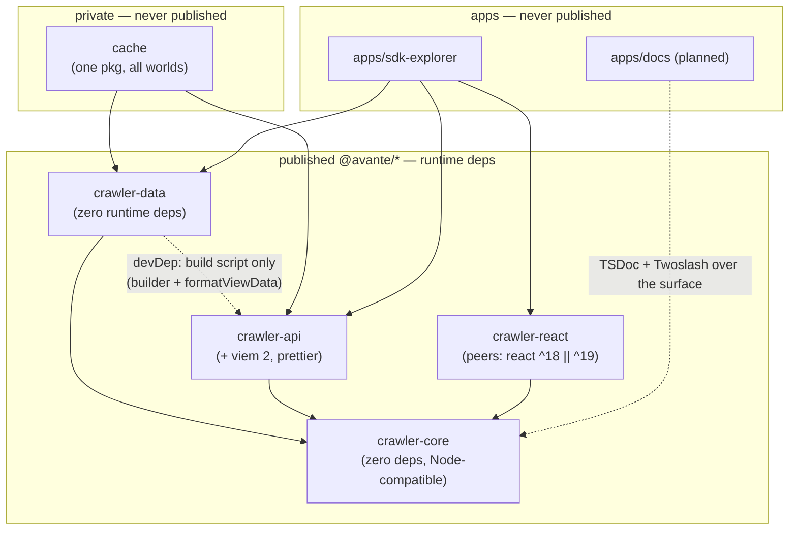

# crawler-sdk — SDK Specification

**Status:** _Living final specification._ This document holds only what is **settled**. It is built incrementally from `specs/SDK_PLAN.md` (the brainstorm / decision log): as decisions there settle, their final form migrates here. Anything provisional, leaning, or OPEN stays in the plan — if a statement here needs hedging, it doesn't belong here yet. **Single home per fact:** once settled, a fact lives here and only here — the plan merely *mentions* it with a `→ SPECS` pointer. Code and this document move in lockstep (see `CLAUDE.md`).

Numbered references like _(#9)_ point into `SDK_PLAN.md`'s decision list, marking where a detail is still being decided; the specification around them stands regardless.

---

## Package map — what each package provides

The workspace inventory: each package, what it provides, and its published name (or explicitly *never published*).

| Package (path) | Published as | Provides |
|---|---|---|
| `packages/crawler-core` | **`@avante/crawler-core`** | The heart: `bigintish` module; schemas (`ec`, `cnc`); `World`/`View` types + read functions; coordinate math (Compass ↔ Coord ↔ Slug, neighbor offsets); the `Crawler` client (handle + container — see §The `Crawler` client) + the chamber-source interface. **Zero runtime deps; Node-compatible (no browser APIs).** Single root export (the legacy `./internal` importer subpath died with the global store). |
| `packages/crawler-data` | **`@avante/crawler-data`** | Static worlds as **one subpath export per world** (`@avante/crawler-data/mainnet`, `/goerli`, `/sepolia`; a `cnc` world in v1) — the root exports **no world JSON**, so bundles carry exactly the worlds imported; each world export **bundles its schema's converter** alongside the world data (see §The `Crawler` client); per-schema **converters** (pure: token payload → `ChamberData<Schema>`; payload types live beside them); the **builder** (build-time module: reads `cache/data`, converts, writes world JSON via the canonical serializer — `formatViewData`, imported from `crawler-api`); the static chamber source. **Zero runtime deps** — `crawler-api` is a devDependency used by the build script only (it also supplies `formatViewData`; `prettier` never enters `crawler-data`). |
| `packages/crawler-api` | **`@avante/crawler-api`** | On-chain layer, viem 2 only — a **pure contract interface** (see §`crawler-api`): fully-typed per-world viem contract instances + parsed-result helpers (`tokenURI` / `ownerOf` / `totalSupply`; caller-supplied RPC or a warned public fallback — never ours); known & generic non-chamber contract helpers (`getCardsContract()`, ERC-20/ERC-721); the **live watcher** (new-minted chambers, raw metadata out); **owner helpers** scoped to the connected player + delegate.xyz (#17); the on-chain chamber source; the **canonical serializer `formatViewData`** (see §Canonical serialization — the package's one non-contract member; must not be removed from this package). Depends on core only (+ viem + prettier). |
| `packages/crawler-react` | **`@avante/crawler-react`** | `CrawlerProvider` + hooks over the explicit `Crawler`/world state; the **localStorage chamber source** (the only browser-dependent code in the SDK). Peers: react ^18 ‖ ^19, core. |
| `cache` | — **never published** (private) | **One contract-agnostic package** archiving `tokenURI` output for every SDK world contract (EC mainnet today; C&C in v1) — per token `<tokenId>.json` (for `ec` worlds with the on-chain `Crawl.ChamberData` struct embedded as `chamber`) + `<tokenId>.svg` (+ `<tokenId>.html`, `ec` only) and a per-`dataDir` `_cache.json` provenance/state file, under `cache/data/<dataDir>/` (`dataDir` includes the deployment, e.g. `endless-crawler/mainnet` — `network` alone collides), committed (see §Data pipeline). Which worlds are cached — and their `dataDir` + RPC env-var name — is declared in `cache/worlds.json`; the contract binding comes from the `crawler-data` world (never restated). **One generic fetch script serves all worlds** (the fetch is contract-agnostic). **Mainnet only** — goerli is unfetchable (dead chain), its world stays frozen as migrated. Fetches via `crawler-api`; consumed by `crawler-data`'s builder. Lives under `cache/` (not `packages/`) precisely so it never leaves the repo. |
| `apps/sdk-explorer` | — never published (app) | The SDK's **browse tool** (cached, parsed, and on-chain data — token SVGs for visuals) and **API provider**: **same-origin-by-default** data routes (chamber lookups + whole-world payloads) plus on-chain routes served **converted to `ChamberData`** (cached-vs-live compare); CORS opt-in per deployment. **Dogfoods the public SDK surface only** — no internal imports. Next 16 App Router. |
| `apps/docs` | — never published (app, planned) | vocs API-reference site built from the TSDoc'd surface + Twoslash examples (#12). |
| `packages/crawler-contracts` | _(planned, out of refactor scope)_ | Solidity contracts — README lists it as planned; untouched by the refactor. |

**Dependency rules:** the published runtime graph is **`data` / `api` / `react` → `core`** and nothing else — `data` never runtime-depends on `api` (build script only), `api` never depends on `data`, `core` depends on nothing. The `cache` package may depend on anything (private, build-time only); it depends on `data` (world binding) + `api` (fetching) + `core`, and `data` never depends back on `cache` (its builder reads `cache/worlds.json` by fs path, not a package import).

**Minimal-consumer rule:** everything that deals directly with `ChamberData` lives in `crawler-core`. A complete game can be built from **`crawler-core` + one world from `crawler-data`** alone — the client and all libraries needed to read chamber data; **`crawler-api`** (live real-time chambers) and **`crawler-react`** (web bindings) are strictly optional add-ons.



_Solid arrows = runtime dependencies (allowed set, exhaustive). Dotted = build-time / tooling relationships that never appear in published `dependencies`._

---

## Type-system rules

- **No `any`** anywhere in the public surface, including the view/read path.
- **Every name used in lookups is a literal-union type** — schema names (`SchemaName = 'ec' | 'cnc'`), coordinate-schema names (`CoordinateSchemaName = 'news' | 'chamber-id'`), view names — never bare `string`.
- **Schemas exist at runtime as plain descriptor objects; the type level derives from the descriptors** (`as const satisfies DataSchema`). One source of truth: the descriptor is both the load-time validator's input and the origin of the derived types (`ChamberData<Schema>`, terrain unions, attribute shapes).
- **Every exported API carries complete, vocs-compatible TSDoc** (`@param`, `@returns`, `@example`, `@remarks`/`@throws`). An undocumented export is an incomplete export; TSDoc is part of each phase's definition of done. (Docs-site generation mechanism: #12.)

---

## Core data type: `BigIntish`

A `BigIntish` is a value that **is** a `bigint` but may be represented in any of four forms, and is **always translatable to a `bigint`**:

```ts
type HexString = `0x${string}`; // strict template-literal type — never plain string
type BigIntish = bigint | number | string /* decimal digits */ | HexString;
```

The decimal-string form cannot be narrowed at the type level; it is validated at runtime (`isBigIntish`). `HexString` is the strict template-literal type (structurally identical to viem's `Address`, so the two interchange without a cast) — JSON input is handled by load-time validation (`loadWorld` parses raw JSON into typed values), never by weakening the type.

- **Home:** a dedicated, self-contained module inside `crawler-core` (`src/bigintish/`) — types, conversions, guards, and its own exhaustive unit tests. No other core module reimplements bigint handling. (Whether it also gets a subpath export is settled at the surface freeze, #7.)
- **Spelling:** `BigIntish`.
- **Used for:** view keys, coords, token IDs, chain ids, and wallet addresses — all `BigIntish`.
- **Functions are pure and total with defined error behavior.** Explicit guards (`isBigIntish`, `isHexString`); conversions (`biToBigInt`, `biToHex`, …) reject malformed input with documented errors — `''` and garbage strings are errors, never silently `0n`; equality uses strict comparison on converted `bigint`s.
- **Addresses are `BigIntish`.** Equality is `bigint` comparison (immune to case/checksum differences); rendering back to checksummed hex is a display concern, outside core.
- **Test coverage is part of the spec:** all four representations, round-trips between them, and edge cases — `0`, negatives, values over 64 bits, odd-length hex, malformed strings.

---

## Chains: network + chain id

- A world's chain binding is **`{ network, chainId, contractAddress, contractName }`** — fields of the **World**, orthogonal to schema (mainnet, goerli, and sepolia all conform to `ec`).
- **`contractName` is required to find the contract's ABI** in `crawler-api`'s artifact registry; `ContractName` is a literal-union type per the type-system rules. It is the **world-bindable subset** of the registry's key union (`KnownContractName`, derived from the bundled artifacts — see §`crawler-api`): every `ContractName` must have a bundled ABI, but the registry also carries non-bindable support contracts.
- **`network`** names the chain family: `'ethereum' | 'base' | 'starknet'`.
- **`chainId` is `BigIntish`.** Starknet ids are `BigIntish`-native; EVM ids are plain numbers (already `BigIntish`) — convert with `Number()` at the EVM boundary.
- EndlessCrawler (`ec`) and Crypts & Caverns (`cnc`) are both on **Ethereum**.

---

## Schemas

A world declares the named **schema** it conforms to (`world.schema = 'ec'`); the specification itself is a **`DataSchema`**. A schema is the axis of variation between level-data formats — it carries only what is **shared by every world conforming to it**; `name`, `network`, `chainId`, `contractAddress`, `contractName` are World fields, not schema fields.

### The two halves: `ChamberSchema` + `CoordinateSchema`

A schema defines both halves; **both live in `crawler-core`**:

- **`ChamberSchema`** — the chamber-payload spec: size policy (fixed or per-chamber), terrain value domain, attribute set, view set.
- **`CoordinateSchema`** — the coordinate system **and the full library of functions to navigate that world**. Core resolves the library from a name → library registry at world load (`coordinateSchema: 'news'`). Coordinate schemas are **reusable**: a new world with its own `ChamberSchema` can adopt an existing `CoordinateSchema`.

**Self-sufficiency invariant:** `ChamberData` carries everything a game needs to navigate chamber-to-chamber (doors with `destCoord`) **without ever calling the `CoordinateSchema` library**. This is what keeps the standard client schema-agnostic: games navigate by door destinations; `Dir`, `offsetCoord`, and compass/slug math are **NEWS library functions**, not standard-client API.

### Coordinate representations

| Form | Type | Storage |
|---|---|---|
| **`Coord`** | packed `BigIntish` | the key of `ChamberData`; the value of `TokenCoord` |
| **`Compass`** | named-directions object | **stored** in `ChamberData` where the `CoordinateSchema` defines one (so data-only consumers get readable positions); a `CoordinateSchema` may have none — `chamber.compass()` → `undefined` |
| **`Slug`** | readable string | **never stored** — computed (`chamber.slug()`); format defined by the `CoordinateSchema` |

### `NEWS` — the first `CoordinateSchema`

North / East / West / South — designed for EndlessCrawler's perfect grid: every chamber has 4 doors, one per edge, and chambers keep being minted indefinitely, so navigation is 4 doors → 4 directions → 4 destination coords. Its library owns `Dir`, `offsetCoord`, and the Compass ↔ Coord ↔ Slug conversions; it is reached through the world (surface shape: #9) and used chiefly by converters at build time to compute door destinations.

### Built-in schema descriptors

Plain, readable runtime objects; the type level derives from them:

```ts
const ec = {
  name: 'ec',
  size: { width: 16, height: 16 },             // fixed → chambers do NOT carry a size
  terrains: ['earth', 'water', 'air', 'fire'], // Terrain value domain — readable strings
  coordinateSchema: 'news',
  views: ['tokenCoord', 'chamberData'],        // views that CAN exist (optional per world)
  attributes: {                                // schema-local gameplay extras
    chapter: 'number',
    gemType: ['silver', 'gold', 'sapphire', 'emerald', 'ruby', 'diamond', 'ethernite', 'kao'],
    gemPos: 'tile',
    coins: 'number',
    worth: 'number',
  },
} as const satisfies DataSchema;

const cnc = {
  name: 'cnc',
  size: 'per-chamber',                         // every ChamberData carries { width, height }
  terrains: ['desert oasis', 'stone temple', 'forest ruins', 'mountain deep', 'underwater keep', "ember's glow"],
  coordinateSchema: 'chamber-id',              // interim rule — real coordinate mapping: #14
  views: ['tokenCoord', 'chamberData'],
  attributes: {
    affinity: 'string',
    legendary: 'boolean',
    structure: ['crypt', 'cavern'],
    pointsOfInterest: 'number',
  },
} as const satisfies DataSchema;

type ECTerrain = (typeof ec)['terrains'][number]; // 'earth' | 'water' | 'air' | 'fire'
```

- **`cnc` has no native coordinates.** Interim rule: `coord = chamber ID`; the real coordinate mapping is specified in #14 (a v1 blocker for the `cnc` converter).
- Core exports the descriptors; a `World` references its schema **by name**, `loadWorld` resolves the descriptor and validates the world JSON against it, and schema-aware functions receive the schema via the world — consumers rarely pass it explicitly.

---

## Worlds & Views

### `World`

A dataset is a **`World`** — a plain, serializable, deeply-typed value conforming to a named schema and **bound to an ERC-721 token contract**:

```ts
type World = {
  name: string;            // 'mainnet' | 'goerli' | 'sepolia' | ...
  network: Network;        // 'ethereum' | 'base' | 'starknet'
  chainId: BigIntish;
  contractAddress: BigIntish; // the ERC-721 token contract address
  contractName: ContractName; // required — finds the contract's ABI in crawler-api's artifact registry
  schema: SchemaName;      // 'ec' | 'cnc'
  views: { ... };          // whichever of the schema's views this world carries
};
```

The world-level fields are **stored as a view** (**`WorldInfo`**, a singleton record — one well-known entry, not a keyed map), so a world is uniformly a set of views with one load/serialize path; the `World` type exposes the fields directly. A world JSON is **fully usable without the SDK** — readable string values, stored `compass`, self-describing `WorldInfo`.

### Views

A **View** is one named, typed keyed map inside a world — plain typed records read by **pure per-view read functions**; the schema enumerates which views *can* exist, each world carries the views it *has*.

| View | Key | Value | Notes |
|---|---|---|---|
| **`WorldInfo`** | — (singleton) | the world-info block | Universal — every world has one, regardless of schema. |
| **`TokenCoord`** | token ID (`BigIntish`) | coord (`BigIntish`) | The **placement relation**: an entry here spawns a chamber into the playable world. |
| **`ChamberData`** | coord (`BigIntish`) | `ChamberData<Schema>` | The data used to build the game world; derived from the token payload by the builder's converters. |
| **`TokenSvg`** | token ID (`BigIntish`) | original SVG (`string`) | The token's **original on-chain SVG, display-only** — see [Token SVGs](#token-svgs--original-only). Its own view (not a `ChamberData` field) so the per-view split escape hatch stays clean for heavy worlds. |

- **Key normalization:** stored keys are **decimal strings**; **hex is always valid input** (keys and values are `BigIntish`); **in memory, always `bigint`**. Each field's canonical serialized form is fixed by the canonical serializer (`formatViewData`).
- **Absent-view semantics:** reading against a view the world doesn't carry **throws a typed error** (`MissingViewError`); `world.hasView(name)` is the capability query. A missing **record** in a present view returns `undefined` — the two misses never conflate.
- **No per-view subpath exports in v1** — worlds ship whole (one subpath per world). The world JSON layout must remain **able to split per view later** (relevant only for very large worlds — `cnc` is ~9,000 dungeons; `ChamberData` is the heavy view, `WorldInfo` the cheap one).
- **Placement & spawning:** a world may contain many `ChamberData` records, but **only chambers whose coord is referenced by a `TokenCoord` entry are spawned and playable**.
- **Provenance is part of the model:** views are deliberately un-normalized — `TokenCoord` (the on-chain placement relation) and `ChamberData` (converter-derived) are stored side by side; neither is derived from the other at load time.
- **Raw token metadata is never carried in a world** — it lives as individual files in the `cache` layer at build time and is transient in the live path. The one exception is the **original token SVG**, which ships in the world as the `TokenSvg` view. (Ownership as a view is unresolved — #17.)

### `ChamberData<Schema>`

Keyed by coord. Two parts: a **normalized, game-facing core** — structurally identical across schemas, so a game can consume any world — and an **`attributes` section typed by the schema**. The generic parameter types the terrain domain and the attributes.

**Normalized core fields:**

| Field | Type / domain | Notes |
|---|---|---|
| `coord` | `BigIntish` | |
| `tokenId` | `BigIntish` | |
| `name` | `string` | every chamber has one; the converter fills it |
| `compass` | per `CoordinateSchema` | **stored** where the coordinate schema defines one |
| `terrain` | `string`, schema's terrain domain | core property on every chamber — never an attribute |
| `yonder` | `number` | |
| `seed` | `BigIntish` | not in the `tokenURI` attributes — rides in the cached **`chamber` struct** (see §Data pipeline) |
| `tilemap` | tile array | the chamber's internal layout |
| `doors` | `Door[]` | see below |
| `size` | `{ width, height }` | present **exactly when** the schema's size policy is `per-chamber` |
| `isDynamic?` | `boolean` | the chamber's final state is not fully defined and may change; the EC converter derives it from locked doors; absent for all `cnc` chambers. For `ec` the on-chain change is **monotone**: locks only ever clear (`LockedExit` → `Exit`, corridors regenerated; a previously locked door may drop entirely) — a door never gains a lock and never appears |

**Attributes** are the schema-local gameplay extras, **string-valued domains**, declared per schema — `ec`: `chapter`, `gemPos`, `gemType`, `coins`, `worth`; `cnc`: `affinity`, `legendary`, `structure`, `pointsOfInterest`. Anything used to build a chamber's topology is a core property, never an attribute.

**Readable string values:** terrain and attribute values (e.g. `gemType`) are stored as strings, per the schema descriptor's declared domains — never numeric enums.

**Not stored** (derivable or replaced):

- `bitmap` — gone entirely: not stored, and no bitmap type or operations exist in the SDK (a 256-bit bitmap cannot represent larger-than-16×16 chambers). The **tilemap is the only map representation**; anything historically called "bitmap" is tilemap vocabulary (and "grid size" is **tilemap size**, fed from the schema's size policy).
- `slug` — never stored; computed via the `CoordinateSchema`.
- `entryDir` — replaced by `Door.isEntry`.
- `locks: boolean[]` — folded into `Door.isLocked`.

The input model used when building from chain data (converter output staging) is a separate type from the stored/read record.

### `Door`

A connection between chambers, in `ChamberData.doors`:

```ts
type Door = {
  tile: number;         // the door's tile in the chamber
  destCoord: BigIntish; // the destination coordinate it leads to
  destTile: number;     // the tile the player enters from on arrival in the destination chamber
  direction?: Dir;      // optional, aesthetic — for map-building only
  isLocked?: boolean;   // undefined = unlocked
  isEntry?: boolean;    // marks the chamber's entry door
};
```

- A chamber has many doors; **games navigate by `destCoord`** — they never need offset math. Navigation helper: `getDoorsTo(dir)` returns `Door[]` (a schema may have several doors per direction).
- The **converter computes `destCoord` at build time** using the schema's `CoordinateSchema` — this is what makes the self-sufficiency invariant hold. **`destTile`** — the arrival tile in the destination chamber — is likewise computed at build time, via the tilemap library's `flipDoorPosition()`.
- Cross-world doors will widen the destination to a world-qualified form (`{ world, coord }`); a same-world neighbor is the degenerate case. The stored identification of the destination world is not yet specified (see `SDK_PLAN.md`, Data model notes).

### Token SVGs — original only

- **Worlds ship the original token SVGs inline**, as the **`TokenSvg`** view (keyed by token ID) — part of the world value and JSON, so access is **sync** like every other static read. The original SVG is **display-only**.
- **Nothing playable ever ships in a world, and no playable transform ships in v1.** Consumers — the explorer included — route and serve the **original SVG** as-is. Endless Crawler (ec-dapp) already owns the original → playable conversion; it **migrates into the SDK at P10** with the ec-dapp import, not before. (The chain's own playable form — tokenURI's `animation_url` HTML — is archived in the private cache as `<tokenId>.html` for reference, but never enters a world.)
- **Size, accepted with eyes open:** EC mainnet is 277 tokens (~1MB of SVG — same order as its world JSON). `cnc` is ~9,000 SVGs × ~4KB ≈ **36MB** on top of an already-large `ChamberData`. The mitigation is already specced: `TokenSvg` is its **own view**, and the world JSON layout must stay splittable per view — if a heavy world ever needs it, the SVGs split out without reshaping any data.
- The goerli world, frozen as migrated, has **no `TokenSvg` view** — views are optional per world, and its SVGs are unfetchable (dead chain).

---

## The `Crawler` client — handle + container

The ergonomic wrapper over the functional core is **two concepts, both in `crawler-core`** (framework-agnostic — `crawler-react` merely holds one). The wrapper is thin: every method delegates to the functional core; it never contains behavior the functions don't already expose.

- **`Crawler` — the multi-world container.** Created **sync** from imported worlds: `createCrawler([mainnetData, goerliData])`. Owns the registered world set, lookup **by name** (`crawler.worlds()` → names; `crawler.world('mainnet')` → handle), and **cross-world traversal** (a cross-world jump resolves to a world-qualified destination — you never "switch"). **No mutable "current world"** — it can't express cross-world jumps and re-creates the global-state smell; if a UI needs one, it's UI state.
- **World handle — per-world, schema-bound.** Method-style reads delegating to the functional core: `world.getChamber(coord)`, `world.hasView(name)`, `world.coords` (the schema's `CoordinateSchema` library, e.g. NEWS), and `world.import(tokenId, payload)` — the live-merge entry point, taking the schema's token payload (see §Data pipeline). (A bare function can't be named `import`, a reserved word — one reason the handle exists.)
- **Converter resolution — bundled with the world import.** Each `crawler-data` per-world subpath export carries the world data **plus its schema's converter**; `createCrawler` builds a schema-keyed converter registry from what it is handed, so `world.import` always has its converter with **zero wiring**. Core defines only the **`Converter` interface** (a `ChamberData`-facing type, per core's boundary criterion) and never imports `crawler-data`; the world **JSON** itself stays plain data, fully usable without the SDK — the subpath module wraps it. Accepted cost: a small pure function rides along even for data-only consumers (negligible next to the world JSON). Rejected: explicit converter injection at `createCrawler` (avoidable wiring); caller-side conversion (guts the one-call ergonomics).
- A `Chamber` carries a **runtime back-pointer to its world handle** (`chamber.world`); the *stored* record stays plain serializable data (no cycles in the JSON).
- **Sync everywhere for static data** — creation, name lookup, and all reads. Only the live tiers (localStorage / on-chain chamber sources) are async, by nature.
- The **exact method inventory** is drafted at the surface freeze (#7); names below are placeholders until then.

```ts
import { createCrawler, Dir } from '@avante/crawler-core';
import mainnetData from '@avante/crawler-data/mainnet'; // world data + its schema's converter,
import goerliData from '@avante/crawler-data/goerli';   // one subpath export per world

const crawler = createCrawler([mainnetData, goerliData]); // sync — the data is already in hand

crawler.worlds();                               // ['mainnet', 'goerli']
const mainnet = crawler.world('mainnet');       // per-world handle, by name
const chamber = mainnet.getChamber(someCoord);  // sync, typed Chamber
chamber.world === mainnet;                      // runtime back-pointer (never serialized)
chamber.slug();                                 // computed via the chamber's CoordinateSchema
chamber.compass();                              // Compass | undefined

// Navigation is DOOR-based — schema-agnostic:
const north = chamber.getDoorsTo(Dir.North);    // Door[]
const next = mainnet.getChamber(north[0].destCoord);

// NEWS-specific math is schema-bound — reached through the world, NOT the standard client:
mainnet.coords.offsetCoord(chamber.coord, Dir.North);
mainnet.coords.coordToSlug(chamber.coord);
```

### Read model: immutable worlds, pure merge, one coarse signal

- A loaded `World` is **immutable** — the read surface has no `.set()` and no per-record mutation. The build path (cache → converter → builder) is a separate surface entirely (see §Data pipeline).
- Live-fetched chambers fold in via a **pure merge**: world + converted records → a **new `World` value**. `world.import(tokenId, payload)` performs convert + pure-merge and swaps the registered value inside the `Crawler` — pure functions underneath, one ergonomic method on top.
- **Per-record change events do not survive** (today's `ViewRecordChanged` bus dies). The `Crawler` exposes a single **typed, environment-agnostic subscription** — a coarse "world updated" signal fired on merge/registration. That is the only reactivity primitive; React re-reads off it. No DOM events; Node-compatible.

---

## Data pipeline & chamber sources

A chamber always originates from an **on-chain ERC-721 token contract**; a World is bound to one (see [Chains](#chains-network--chain-id)). The pipeline from chain to published world:

1. **Cache — one private, contract-agnostic package** (`cache`) archiving `tokenURI` output for every SDK world contract. Per token, **two committed files** — three for `ec`-schema worlds — plus a per-`dataDir` **provenance/state file**, under one directory per world:

   ```
   cache/worlds.json                    # registry: world name → { dataDir, rpcEnv }
   cache/data/<dataDir>/<tokenId>.json  # the tokenURI metadata JSON (ec: + the struct embedded as `chamber`)
   cache/data/<dataDir>/<tokenId>.svg   # the decoded SVG, pretty-printed (prettier)
   cache/data/<dataDir>/<tokenId>.html  # ec only: the decoded animation_url player, pretty-printed
   cache/data/<dataDir>/_cache.json     # fetch provenance + state (below)
   ```

   - **`worlds.json` — the lean registry.** Keyed by world `name` → `{ dataDir, rpcEnv }` (`rpcEnv` is the RPC **env-var name**, never a secret). `dataDir` is the archive path under `data/`, **including the deployment** (e.g. `endless-crawler/mainnet`) — carried whole, not derived as `<game>/<network>`, because `network` alone collides (sepolia is also `ethereum`). Its keyset **is** the cache coverage — goerli is a `crawler-data` world but is never listed, so it is never cached. Everything else (network, chainId, contract address, ABI) comes from the `crawler-data` world resolved by that name + `crawler-api`'s `getWorldContract(world)`; the binding has **one home** (the world) and is never restated in the registry.
   - The `.json` is the tokenURI JSON **with its data-URI blob fields extracted**: `image` is decoded into the sibling `.svg`; `animation_url` is decoded into the sibling `.html`. Everything else is stored as returned. For `ec` worlds it additionally embeds a **`chamber` field** — the **on-chain `Crawl.ChamberData` struct**, read at the pinned block via the typed world contract, `tokenIdToCoord(tokenId)` → `coordToChamberData(chapter, coord, generateMaps: true)` (`chapter` from the same metadata's `Chapter` attribute) — because **the SVG alone does not carry the full map data** the converter needs (notably the generated `tilemap`). (Named `chamber`, **not** `chamberData` — the view of that name has a different, converted shape.) Files are byte-stable via the canonical serializer.
   - The `.svg` is the decoded `image` **pretty-printed with prettier** (its html parser) for a readable, diff-friendly, byte-stable archive. It is therefore *reflowed*, not byte-identical to the on-chain original (it renders identically); this is the form the P6 builder carries into the world's `TokenSvg` view and that consumers serve.
   - The `.html` (`ec` worlds) is the decoded `animation_url` — **the chain's own playable form** (the same SVG in an HTML player) — pretty-printed like the `.svg`. Archived for reference; it never ships in a world (see §Token SVGs).
   - **`_cache.json` — provenance + fetch state**, one per `dataDir`, byte-stable via the canonical serializer, excluded from the token-contiguity invariant (leading `_`). It echoes the source binding (world `name`, `network`, `chainId`, `contractName`, `contractAddress`) so the archive is self-describing about where it came from, plus `fetchedThroughBlock`, `updatedAt`, and a `tokens` map of `tokenId → { block, fetchedAt }` (decimal-string block, ISO-8601 UTC time).
   - **Fetch strategy — missing-only, block-pinned, idempotent.** No manifest of the fetch *list* — file presence is the record. Each run **pins one block `B`** at the start and reads everything `at` `B` (a single consistent snapshot); fetch list = on-chain `1..totalSupply` **minus** the tokens already *complete* on disk — a token missing **any** of its required files is refetched whole (deterministic content + canonical formatters make the rewrite byte-stable), so a layout addition backfills the archive on the next run. Presence can't see *content*: on a file-**shape** change (e.g. a new embedded field), delete the affected files and re-run. Each fetched token is stamped `{ block: B, fetchedAt }`. `fetchedThroughBlock` advances to `B` on **every** clean run (even when nothing was fetched), so a future staleness scan starts from `B+1`. A second run fetches nothing (only the watermark moves).
   - **Invalidation is a schema-level policy (in `crawler-core`), currently empty.** No chamber is refetched for staleness in v1 — EC's large boundary makes blanket dynamic refetch far too broad. The **Minted-neighbour** model (a mint invalidates its NEWS-neighbour chambers, via one pure core primitive that also serves live clients) is designed together with **real-time updates** (→ plan #16) because it is the same mechanic; `_cache.json`'s block + watermark data is banked now so it is ready when that lands.
   - **Errors:** each on-chain read retries **3× with a 1 s wait**, then aborts the run non-zero. Written files persist and the watermark only advances on a clean finish, so a rerun resumes safely.
   - RPC is caller-supplied (the `worlds.json` entry's env var) and **required** — the run aborts up front if any registered world's env var is unset, listing them; there is no public-RPC fallback for the archive (it is rate-limited and unreliable across hundreds of tokens, even though the api offers one for other callers). **One generic script** fetches over every registered world.
   - **Coverage: mainnet only.** Goerli's chain is dead — no RPC exists, so its cache can never be fetched; the goerli world exists solely via the one-off migration and stays **frozen** (it never gains a `TokenSvg` view). Sepolia is added when a deployment exists.
   - The cache only reads on-chain data and writes files — no game logic. Private, never published.

2. **Converters — per-schema pure functions in `crawler-data`.** The schema's **token payload** → `ChamberData<Schema>`: strings in, typed values out, **no fetching inside**, synchronous, normalized signatures, types from the SDK. One per schema (`ec`, `cnc` — both ship in v1), each acting over one cache's file shape. Payload types live beside their converter in `crawler-data`; core defines only the generic `Converter` interface.

   ```ts
   type EcTokenPayload = {
     tokenId: BigIntish;
     metadata: EcTokenMetadata & EcChamberMetadata; // the cached tokenURI JSON (blob fields
     //   extracted) intersected with the embedded on-chain struct ({ chamber: … })
     svg: string;                                   // the decoded original SVG — tokenSvg view only
   };
   ```

   - **The `ec` converter reads the map from the embedded `chamber` struct** (`metadata.chamber` — the raw `Crawl.ChamberData` archived by the cache): `tilemap` (generated bytes → the tile array), `doors`/`locks` (NEWS-ordered positions; `0` = no door on that edge), `seed`, `gemPos`. **The SVG is display-only** — it does not carry the full map data (that finding is why the cache archives the struct); the converter passes it through untouched for the `TokenSvg` view. Terrain, gem, coins, worth, yonder, chapter, and name come from the metadata attributes (already readable strings); `coord` is packed from the compass traits (`North`/`East`/`West`/`South`) via the schema's `CoordinateSchema` (NEWS) and must agree with `chamber.coord`. Doors' `destCoord` is computed via NEWS offsets, and their `destTile` via the tilemap library's `flipDoorPosition()`.
   - **Surface:** the `ec` converter ships as **`ecConverter`** beside its payload types (`EcTokenPayload`, `EcTokenMetadata`, `EcChamberMetadata`, `EcChamberStruct`) in `crawler-data` (`src/converters/ec/`; root export until the per-world subpaths land). Struct fields are `BigIntish`, so the cached JSON form and a live viem-decoded struct assemble into the same payload. A malformed or self-inconsistent payload (compass/struct coord disagreement, out-of-domain trait values, truncated tilemap, tokenId mismatch) **throws `TokenConversionError`** — broken data never enters a world.
   - **On-chain supplements.** Fields that exist only on-chain ride in the cached payload — `ec` needs no separate supplement fetch: `seed` (and everything else struct-borne) arrives inside `metadata.chamber`, put there by the cache/**payload assembler** via `crawler-api` — never by the converter (purity keeps converters bundleable with the world exports for `world.import`).
   - `crawler-api` is the single place that fetches; `crawler-data` is the single place that converts — the api enters `crawler-data` as a build-script devDependency only. At runtime, a converter reaches the `Crawler` bundled with each per-world subpath export (see §The `Crawler` client).

3. **Builder — build-time module in `crawler-data`.** Reads a cache (each world's directory resolved from `cache/worlds.json` by fs path — never a package import, so `crawler-data` never depends on `cache`), converts, and assembles the world JSON — **fully offline for `ec`**: the on-chain facts (`seed` included) already ride in each cached token's `chamber` struct, so the builder makes no chain calls — through the canonical serializer (see below): `WorldInfo` (stamped with a real build `timestamp`, ISO 8601 UTC), `TokenCoord`, `ChamberData`, and the original token SVGs as the `TokenSvg` view. Raw metadata JSON is never shipped in a world; nothing playable is ever stored (see §Worlds & Views, Token SVGs). Runs as a script in `crawler-data`; covers the cached worlds only (mainnet — goerli stays frozen as migrated).
4. **Live watcher — optional module in `crawler-api`.** Watches for newly minted tokens not yet in `crawler-data` and yields **raw metadata**; the **caller** assembles the converter payload (fetching the on-chain `chamber` struct the same way) and applies the converter (`crawler-api` never depends on `crawler-data`). RPC is always caller-supplied or a public one — never ours. Games may opt out and use cached chambers only. (Mechanics: #16.)
5. **Live-chamber persistence — `crawler-react` only.** Live-fetched chambers can persist in browser localStorage so a refresh doesn't refetch; the `Crawler` client itself never depends on a browser. (Mechanics: #16.)
6. **Publish cadence.** `crawler-data` is updated and redeployed frequently (daily or weekly) to fold newly minted chambers into the static worlds.

### Chamber sources — three tiers

The `Crawler` resolves chamber data from pluggable, **consumer-injected chamber sources**, in priority order (core imports none of the packages involved):

1. **static worlds** — imported from `crawler-data`;
2. **localStorage** — previously live-fetched chambers (browser only; the source ships in `crawler-react`);
3. **on-chain** — live fetch through `crawler-api`.

(The source interface's name is unsettled — see the plan's glossary.)

---

## `crawler-api` — the contract layer

The api is the SDK's **only on-chain surface** (core has zero on-chain deps) and is a **pure contract interface**: it talks to contracts and delivers **parsed results** — viem-decoded values, `BigIntish`-normalized, `tokenURI` data-URIs unpacked — to its callers (the `Crawler`/world live tier, the `cache` package, the explorer's routes, consumers). No game logic, no conversion (callers convert — the pipeline rule), no view definitions. Its one non-contract member is the canonical serializer (see §Canonical serialization).

- **A fully-typed viem contract instance per world**, built from the world's contract binding — `network`, `chainId`, `contractAddress`, ABI (resolved by `contractName` from the artifact registry), optional `rpcUrl`. **ABIs are sourced from the original artifact JSON and derived into const-asserted TS by a build-time codegen step** — viem's type inference requires literal types, which JSON imports cannot carry, so the generated `as const` TS module is what the code imports; it is **never hand-written and never committed** (git-ignored + Biome-excluded; the artifact JSON stays the single committed source of truth) — the package's `gen` script regenerates it, and every compile/type-check/test path runs `gen` first, so a fresh clone needs no manual step. The artifact `networks` address tables never enter the generated output — addresses come from bindings/callers. **Every committed artifact is a registry entry**; only live contracts ship (`src/artifacts/`: `CrawlerToken`, `CardsMinter`, `CrawlerIndex`, `CrawlerPlayer`, `CrawlerQueryV1`, `CrawlerGeneratorV1`, `CrawlerMapperV1`, `CrawlerRendererV1`; C&C's contract when it lands) — dead artifact trees are deleted. The registry key union **`KnownContractName`** derives from the generated registry and is a superset of the world-bindable `ContractName` (§Chains); `getContractAbi(name)` resolves fully typed by name, `contractAbis` is direct typed access. The standard ERC-20/ERC-721 ABIs have no artifacts — viem's bundled const-asserted `erc20Abi`/`erc721Abi` are used directly (platform over hand-authoring).
- **RPC fallback warns, never silent.** `rpcUrl` undefined → viem's default public RPC for the chain **plus a `console.warn`**. The chain always comes from the binding — there is no default chain.
- **Known non-chamber contracts:** **`getCardsContract()`** — the EndlessCrawler Cards contract, typed by its bundled ABI; the caller supplies the contract address (cards are part of EndlessCrawler but not part of a world binding).
- **Generic standard contracts:** ERC-20/ERC-721 helpers with **bundled const-asserted standard ABIs** — the caller supplies only the address; arbitrary contracts take an explicit ABI.
- **`BigIntish` addresses at every boundary.** All addresses (contract + wallet) crossing the api surface are `BigIntish`; conversion to viem's `` `0x${string}` `` `Address` happens inside the api, via core's `bigintish` module.
- **Pipeline struct reads go through the typed world contract** (e.g. `ec`'s `tokenIdToCoord` → `coordToChamberData` for the cache's embedded `chamber` struct — see §Data pipeline); no bespoke helpers for them.
- **Event listeners live here** (`Minted`, `MetadataUpdate`, …) — the set and mechanics are decided with the live path (P8, #16).
- **Starknet seam noted, not designed.** viem is EVM-only; `network: 'starknet'` (§Chains) will someday need a parallel client layer. All v1 contracts are Ethereum.

Illustrative shape (final names at the surface freeze, #7):

```ts
// world contract — fully-typed viem instance from the World's binding
const contract = getWorldContract(world, { rpcUrl }); // viem getContract; ABI via world.contractName
await contract.read.totalSupply();                    // typed by the as-const ABI
await contract.read.tokenURI([123n]);

// parsed-result helpers the pipeline needs (raw metadata out — the CALLER converts)
await readTokenMetadata(world, tokenId, { rpcUrl }); // tokenURI unpacked → { metadata, svg, html? }
                                                     // (`image` lifted out, delivered decoded as `svg`)
await readTotalSupply(world, { rpcUrl });            // → bigint
await readOwnerOf(world, tokenId, { rpcUrl });       // → checksummed HexString (wallet address)
// every read helper takes an optional `blockNumber` (ReadOptions) to pin a
// consistent snapshot — the cache reads all of a run's tokens `at` one block

// known non-chamber contracts — EndlessCrawler Cards / CardsMinter (caller supplies chain + address)
const cards = getCardsContract({ chainId, contractAddress, rpcUrl });

// generic standard contracts — chain + address are BigIntish, converted internally
const erc20 = getErc20({ chainId, contractAddress, rpcUrl }); // viem's bundled standard ABIs
const other = getTypedContract({ chainId, contractAddress, abi: getContractAbi('CrawlerIndex'), rpcUrl });
await erc20.read.balanceOf([playerAddress]);

// events — shape open until P8 (#16)
watchMinted(world, (tokenId) => {
  /* fetch raw metadata + on-chain supplement → world.import(tokenId, payload) */
});
```

---

## Canonical serialization

- **`formatViewData` in `crawler-api`** (`src/lib/utils/formatter.ts`, exported from the package root) is the canonical dataset serializer and **must not be removed from that package**.
- **Home rationale (the api's one non-contract member):** serialization only ever happens beside on-chain fetching — the builder, cache tooling, and migration scripts all just went on-chain, so `crawler-api` is already present. Nothing serializes at runtime (`world.import` merges in memory), and npm deps are package-wide — hosting it in `crawler-data` or core would push prettier into the zero-dep packages every minimal consumer installs.
- **Every views-data create/update goes through it**, so files are byte-stable across regenerations.
- Output is **compact and human-readable**: arrays kept inline, structure legible, `bigint`s handled. `JSON.stringify(…, 2)` is banned for datasets — it explodes door/lock arrays one element per line.
- Each field's canonical stored form is fixed here: decimal-string keys; bigint values as numbers when ≤ `Number.MAX_SAFE_INTEGER`, decimal strings past it (coords are always strings in practice); hex where it reads better (e.g. `seed`); door `direction` as its readable name (`'North'`, …); compass directions as numbers.
- `prettier` is a runtime dependency of published `crawler-api` (footprint revisited at the surface freeze, #7).
- No `BigInt.prototype.toJSON` monkeypatch — `bigint` handling is local to the formatter (`crawler-api` declares `sideEffects: false`).

---

## `apps/sdk-explorer` — browse tool & data API

- **Dogfooding rule:** the explorer uses the public SDK surface only — no internal imports, no privileged paths. It is a living integration test of the published surface.
- **Two same-origin-by-default route families** (no CORS headers; a deployment can opt in — e.g. a local-network game, which also makes it a remote world source):
  - **data routes** — granular chamber lookups and whole-world payloads (the same-origin default guards the huge-payload risk; a `cnc` world can be very large);
  - **on-chain routes** — cached-vs-live compare/preview, served **converted to `ChamberData`** (the explorer applies the converter server-side; the api stays raw).
- **Visual browsing:** the token SVGs (shipped in the worlds themselves as `TokenSvg`); a chamber's public URL destination serves the **original SVG**. The playable form arrives with the P10 converter migration (see §Worlds & Views, Token SVGs).
- The explorer is **not a provider** — no ops commitment. Same-origin guards browser-based abuse only; non-browser scripts can still hit a public deployment (acceptable for a tool).
